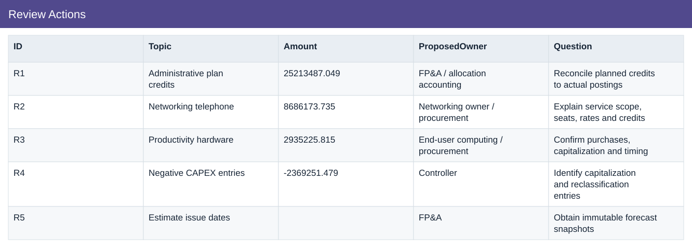
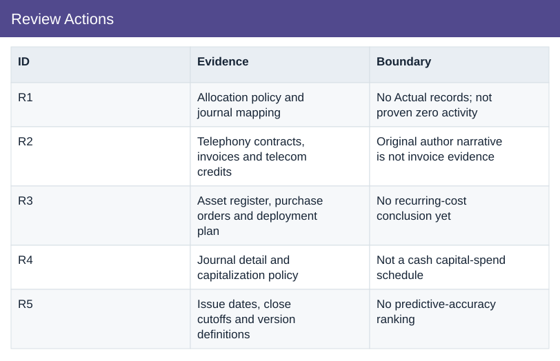

# Review Actions

[Download data](<../outputs/I8_Review_Actions.csv>) · [Back to data](../README.md)

## Review Actions

Prepare specific evidence requests for budget-owner review.

### Fields

| Field | Meaning | Format | Example |
|---|---|---|---|
| ID | — | Text | R1 |
| Topic | — | Text | Administrative plan credits |
| Amount | — | Number | 25213487.049 |
| ProposedOwner | Suggested review role, not an assigned or contacted owner. | Text | FP&A / allocation accounting |
| Question | — | Text | Reconcile planned credits to actual postings |
| Evidence | — | Text | Allocation policy and journal mapping |
| Boundary | Limits on what the analysis can establish. | Text | No Actual records; not proven zero activity |

