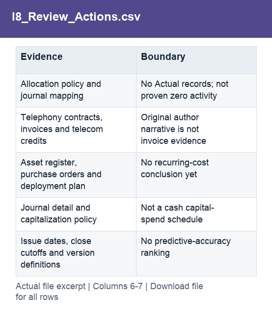

# I8_Review_Actions.csv

[Download the complete file](../outputs/I8_Review_Actions.csv) · [Back to data guide](../README.md)

**Purpose:** Prepare specific evidence requests for budget-owner review.

**Rows:** 7. **Fields:** 7. CSV files store text; the type rules below describe how to interpret the values during import. The images render the actual first five records, with wide tables split into consecutive column panels. They are data excerpts, not screenshots of the Excel application.

## Fields and formats

| Field | Meaning / use | Import and display | Example |
|---|---|---|---|
| ID | Field retained under its source/output label; interpret with the table purpose and displayed example. | Identifier; preserve as text, including leading zeros | R1 |
| Topic | Field retained under its source/output label; interpret with the table purpose and displayed example. | Text / categorical label; preserve spelling and blanks | Administrative plan credits |
| Amount | Field retained under its source/output label; interpret with the table purpose and displayed example. | Numeric; preserve full precision, display amount with 2 decimals where applicable | 25213487.049 |
| ProposedOwner | Suggested review role, not an assigned or contacted owner. | Text / categorical label; preserve spelling and blanks | FP&A / allocation accounting |
| Question | Field retained under its source/output label; interpret with the table purpose and displayed example. | Text / categorical label; preserve spelling and blanks | Reconcile planned credits to actual postings |
| Evidence | Field retained under its source/output label; interpret with the table purpose and displayed example. | Text / categorical label; preserve spelling and blanks | Allocation policy and journal mapping |
| Boundary | Limits on what the analysis can establish. | Text / categorical label; preserve spelling and blanks | No Actual records; not proven zero activity |
