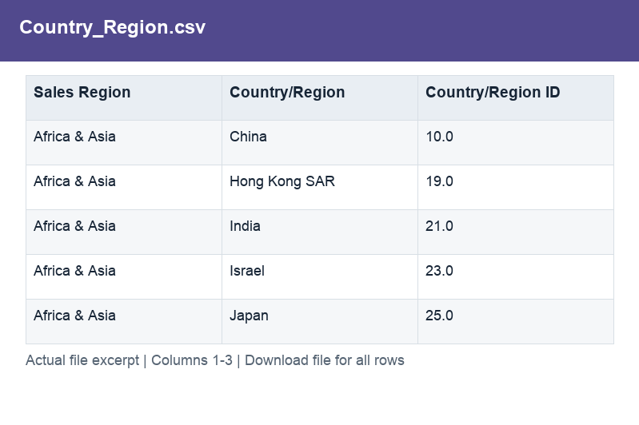

# Country_Region.csv

[Download the complete file](../prepared_inputs/I1_Extracted_Data/Country_Region.csv) · [Back to data guide](../README.md)

**Purpose:** Provide a prepared table for consistent joins, filtering and analysis.

**Rows:** 52. **Fields:** 3. CSV files store text; the type rules below describe how to interpret the values during import. The images render the actual first five records, with wide tables split into consecutive column panels. They are data excerpts, not screenshots of the Excel application.

## Fields and formats

| Field | Meaning / use | Import and display | Example |
|---|---|---|---|
| Sales Region | Grouping, filter or comparison label for sales region. | Text / categorical label; preserve spelling and blanks | Africa & Asia |
| Country/Region | Country/region dimension label. | Text / categorical label; preserve spelling and blanks | China |
| Country/Region ID | Field retained under its source/output label; interpret with the table purpose and displayed example. | Numeric; preserve full precision, display amount with 2 decimals where applicable | 10.0 |
