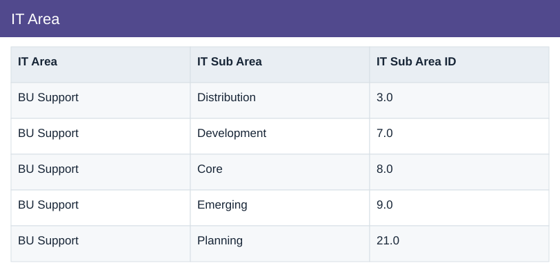

# IT Area

[Download data](<../prepared_inputs/I1_Extracted_Data/IT_Area.csv>) · [Back to data](../README.md)

## IT Area

View the budget, actual amounts and calculations.

### Fields

| Field | Format | Example |
|---|---|---|
| IT Area | Text | BU Support |
| IT Sub Area | Text | Distribution |
| IT Sub Area ID | Number | 3.0 |

