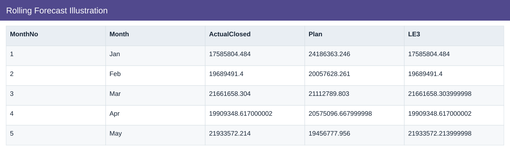
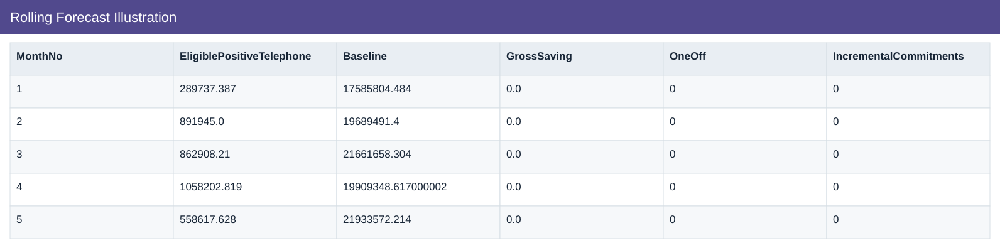
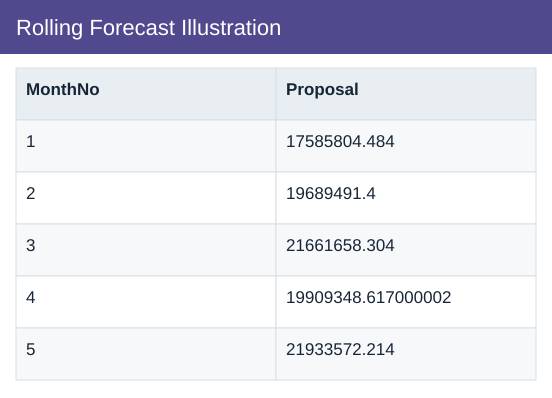

# Rolling Forecast Illustration

[Download data](<../outputs/I10_Rolling_Forecast_Illustration.csv>) · [Back to data](../README.md)

## Rolling Forecast Illustration

Combine closed actuals with remaining estimates and scenario actions.

### Fields

| Field | Meaning | Format | Example |
|---|---|---|---|
| MonthNo | Month number used for chronological sorting. | Number | 1 |
| Month | Month label or month-start key. | Text | Jan |
| ActualClosed | Actual spend for the modelled closed months. | Number | 17585804.484 |
| Plan | Planned scenario amount. | Number | 24186363.246 |
| LE3 | Latest estimate version 3. | Number | 17585804.484 |
| EligiblePositiveTelephone | — | Number | 289737.387 |
| Baseline | Closed actuals plus the remaining estimate. | Number | 17585804.484 |
| GrossSaving | Illustrative gross benefit before implementation costs. | Number | 0.0 |
| OneOff | Illustrative one-time implementation cost. | Number | 0 |
| IncrementalCommitments | — | Number | 0 |
| Proposal | Baseline less gross savings plus one-off costs and incremental commitments. | Number | 17585804.484 |

