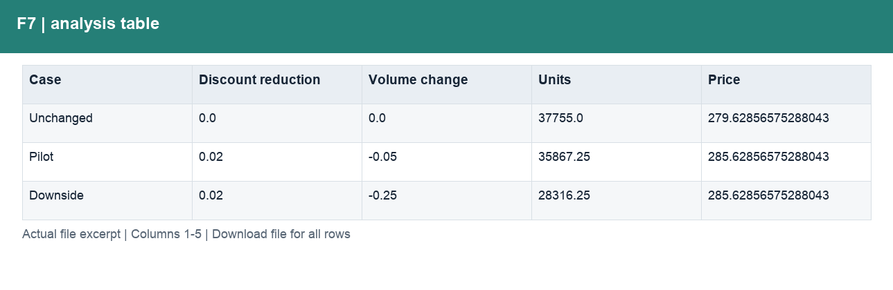
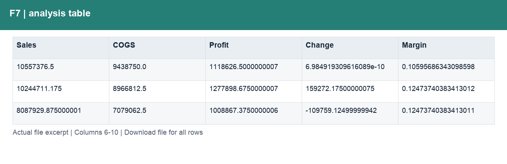
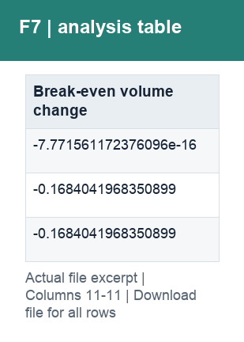

# F7_折扣政策情景.csv

[Download the complete file](../outputs/F7_折扣政策情景.csv) · [Back to data guide](../README.md)

**Purpose:** Test discount and volume scenarios.

**Rows:** 3. **Fields:** 11. CSV files store text; the type rules below describe how to interpret the values during import. The images render the actual first five records, with wide tables split into consecutive column panels. They are data excerpts, not screenshots of the Excel application.

## Fields and formats

| Field | Meaning / use | Import and display | Example |
|---|---|---|---|
| Case | Grouping, filter or comparison label for case. | Text / categorical label; preserve spelling and blanks | Unchanged |
| Discount reduction | Field retained under its source/output label; interpret with the table purpose and displayed example. | Decimal ratio; display as 0.0% (0.10 = 10%) | 0.0 |
| Volume change | Field retained under its source/output label; interpret with the table purpose and displayed example. | Decimal ratio; display as 0.0% (0.10 = 10%) | 0.0 |
| Units | Field retained under its source/output label; interpret with the table purpose and displayed example. | Numeric; counts as whole numbers, units/durations retain needed decimals | 37755.0 |
| Price | Field retained under its source/output label; interpret with the table purpose and displayed example. | Numeric; preserve full precision, display amount with 2 decimals where applicable | 279.62856575288043 |
| Sales | Net sales after discounts. | Numeric; preserve full precision, display amount with 2 decimals where applicable | 10557376.5 |
| COGS | Cost of goods sold from the source sample. | Numeric; preserve full precision, display amount with 2 decimals where applicable | 9438750.0 |
| Profit | Sales less COGS; not full company net profit. | Numeric; preserve full precision, display amount with 2 decimals where applicable | 1118626.5000000007 |
| Change | Field retained under its source/output label; interpret with the table purpose and displayed example. | Numeric; preserve full precision, display amount with 2 decimals where applicable | 6.984919309616089e-10 |
| Margin | Aggregate profit divided by aggregate sales. | Decimal ratio; display as 0.0% (0.10 = 10%) | 0.10595686343098598 |
| Break-even volume change | Field retained under its source/output label; interpret with the table purpose and displayed example. | Decimal ratio; display as 0.0% (0.10 = 10%) | -7.771561172376096e-16 |
