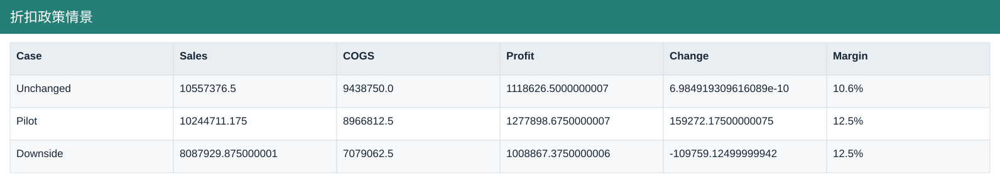
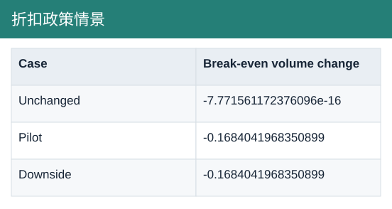

# 折扣政策情景

[Download data](<../outputs/F7_折扣政策情景.csv>) · [Back to data](../README.md)

## 折扣政策情景

Test discount and volume scenarios.

### Fields

| Field | Meaning | Format | Example |
|---|---|---|---|
| Case | — | Text | Unchanged |
| Discount reduction | — | Number | 0.0 |
| Volume change | — | Number | 0.0 |
| Units | — | Number | 37755.0 |
| Price | — | Number | 279.62856575288043 |
| Sales | Net sales after discounts. | Number | 10557376.5 |
| COGS | Cost of goods sold from the source sample. | Number | 9438750.0 |
| Profit | Sales less COGS; not full company net profit. | Number | 1118626.5000000007 |
| Change | — | Text | 6.984919309616089e-10 |
| Margin | Aggregate profit divided by aggregate sales. | Percentage | 10.6% |
| Break-even volume change | — | Text | -7.771561172376096e-16 |

