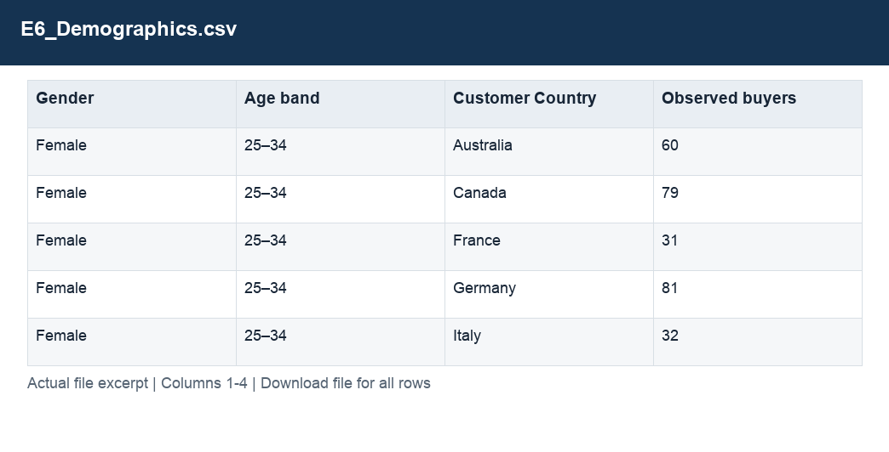

# E6_Demographics.csv

[Download the complete file](../outputs/E6_Demographics.csv) · [Back to data guide](../README.md)

**Purpose:** Measure repeat purchasing with complete observation windows.

**Rows:** 96. **Fields:** 4. CSV files store text; the type rules below describe how to interpret the values during import. The images render the actual first five records, with wide tables split into consecutive column panels. They are data excerpts, not screenshots of the Excel application.

## Fields and formats

| Field | Meaning / use | Import and display | Example |
|---|---|---|---|
| Gender | Grouping, filter or comparison label for gender. | Text / categorical label; preserve spelling and blanks | Female |
| Age band | Grouping, filter or comparison label for age band. | Text / categorical label; preserve spelling and blanks | 25–34 |
| Customer Country | Grouping, filter or comparison label for customer country. | Text / categorical label; preserve spelling and blanks | Australia |
| Observed buyers | Field retained under its source/output label; interpret with the table purpose and displayed example. | Numeric; preserve full precision, display amount with 2 decimals where applicable | 60 |
