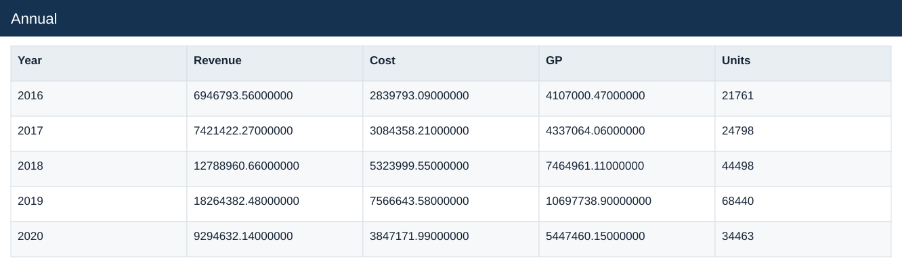
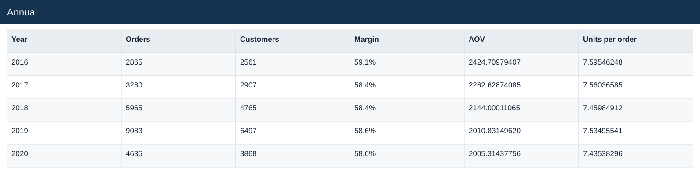

# Annual

[Download data](<../outputs/E3_Annual.csv>) · [Back to data](../README.md)

## Annual

Explain order and channel performance over time.

### Fields

| Field | Meaning | Format | Example |
|---|---|---|---|
| Year | Calendar year. | Number | 2016 |
| Revenue | Estimated sales: quantity × static product unit price. | Number | 6946793.56000000 |
| Cost | Quantity × unit product cost. | Number | 2839793.09000000 |
| GP | Estimated gross profit: revenue less cost. | Number | 4107000.47000000 |
| Units | — | Number | 21761 |
| Orders | — | Number | 2865 |
| Customers | — | Number | 2561 |
| Margin | Aggregate profit divided by aggregate sales. | Percentage | 59.1% |
| AOV | Revenue divided by distinct orders. | Number | 2424.70979407 |
| Units per order | Total units divided by distinct orders. | Number | 7.59546248 |

