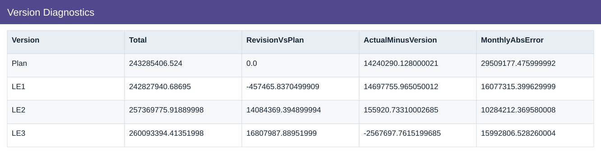
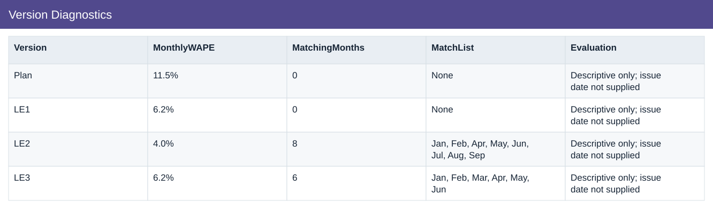

# Version Diagnostics

[Download data](<../outputs/I5-I6_Version_Diagnostics.csv>) · [Back to data](../README.md)

## Version Diagnostics

Compare estimate versions and diagnose overlap with actuals.

### Fields

| Field | Meaning | Format | Example |
|---|---|---|---|
| Version | — | Text | Plan |
| Total | — | Number | 243285406.524 |
| RevisionVsPlan | Version total less annual Plan. | Number | 0.0 |
| ActualMinusVersion | Annual Actual less the selected version total. | Number | 14240290.128000021 |
| MonthlyAbsError | Sum of absolute monthly version differences. | Number | 29509177.475999992 |
| MonthlyWAPE | Sum of absolute monthly differences divided by absolute actuals. | Percentage | 11.5% |
| MatchingMonths | Number of months whose company total matches Actual. | Number | 0 |
| MatchList | — | Text | None |
| Evaluation | — | Text | Descriptive only; issue date not supplied |

