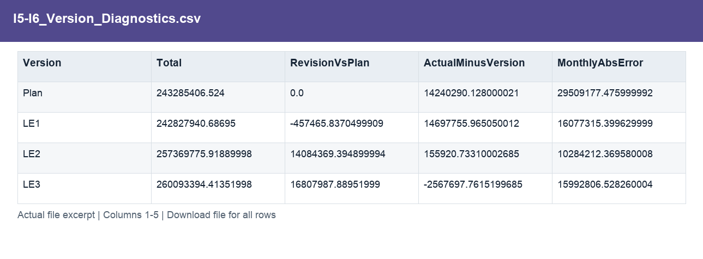
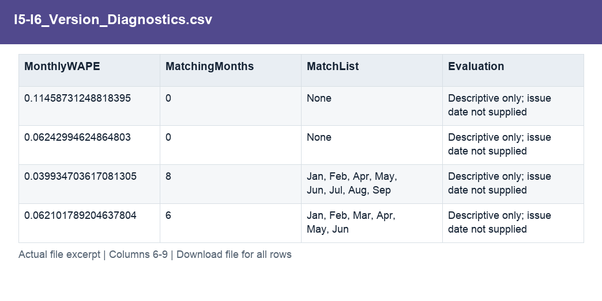

# I5-I6_Version_Diagnostics.csv

[Download the complete file](../outputs/I5-I6_Version_Diagnostics.csv) · [Back to data guide](../README.md)

**Purpose:** Compare estimate versions and diagnose overlap with actuals.

**Rows:** 4. **Fields:** 9. CSV files store text; the type rules below describe how to interpret the values during import. The images render the actual first five records, with wide tables split into consecutive column panels. They are data excerpts, not screenshots of the Excel application.

## Fields and formats

| Field | Meaning / use | Import and display | Example |
|---|---|---|---|
| Version | Grouping, filter or comparison label for version. | Text / categorical label; preserve spelling and blanks | Plan |
| Total | Field retained under its source/output label; interpret with the table purpose and displayed example. | Numeric; preserve full precision, display amount with 2 decimals where applicable | 243285406.524 |
| RevisionVsPlan | Version total less annual Plan. | Numeric; preserve full precision, display amount with 2 decimals where applicable | 0.0 |
| ActualMinusVersion | Annual Actual less the selected version total. | Numeric; preserve full precision, display amount with 2 decimals where applicable | 14240290.128000021 |
| MonthlyAbsError | Sum of absolute monthly version differences. | Numeric; preserve full precision, display amount with 2 decimals where applicable | 29509177.475999992 |
| MonthlyWAPE | Sum of absolute monthly differences divided by absolute actuals. | Decimal ratio; display as 0.0% (0.10 = 10%) | 0.11458731248818395 |
| MatchingMonths | Number of months whose company total matches Actual. | Numeric; preserve full precision, display amount with 2 decimals where applicable | 0 |
| MatchList | Field retained under its source/output label; interpret with the table purpose and displayed example. | Text / categorical label; preserve spelling and blanks | None |
| Evaluation | Field retained under its source/output label; interpret with the table purpose and displayed example. | Text / categorical label; preserve spelling and blanks | Descriptive only; issue date not supplied |
