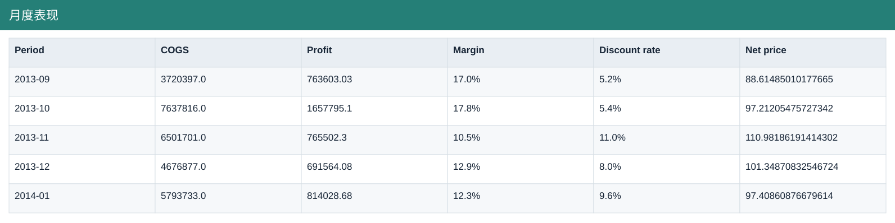

# 月度表现

[Download data](<../outputs/F2_月度表现.csv>) · [Back to data](../README.md)

## 月度表现

Measure monthly commercial performance.

### Fields

| Field | Meaning | Format | Example |
|---|---|---|---|
| Period | — | Text | 2013-09 |
| Units Sold | Sample units sold; fractional values are preserved. | Number | 50601.0 |
| Gross Sales | Units sold × sale price, before discounts. | Number | 4729736.0 |
| Discounts | Discount amount deducted from gross sales. | Number | 245735.97 |
| Sales | Net sales after discounts. | Number | 4484000.03 |
| COGS | Cost of goods sold from the source sample. | Number | 3720397.0 |
| Profit | Sales less COGS; not full company net profit. | Number | 763603.03 |
| Margin | Aggregate profit divided by aggregate sales. | Percentage | 17.0% |
| Discount rate | Total discounts divided by total gross sales. | Percentage | 5.2% |
| Net price | Net sales divided by units sold. | Number | 88.61485010177665 |

