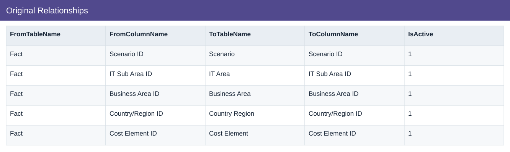
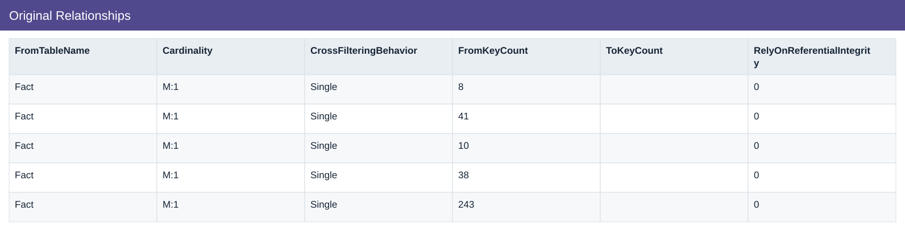

# Original Relationships

[Download data](<../prepared_inputs/I1_Extracted_Data/Original_Relationships.csv>) · [Back to data](../README.md)

## Original Relationships

View the budget, actual amounts and calculations.

### Fields

| Field | Format | Example |
|---|---|---|
| FromTableName | Text | Fact |
| FromColumnName | Text | Scenario ID |
| ToTableName | Text | Scenario |
| ToColumnName | Text | Scenario ID |
| IsActive | Number | 1 |
| Cardinality | Text | M:1 |
| CrossFilteringBehavior | Text | Single |
| FromKeyCount | Number | 8 |
| ToKeyCount | Text | — |
| RelyOnReferentialIntegrity | Number | 0 |

