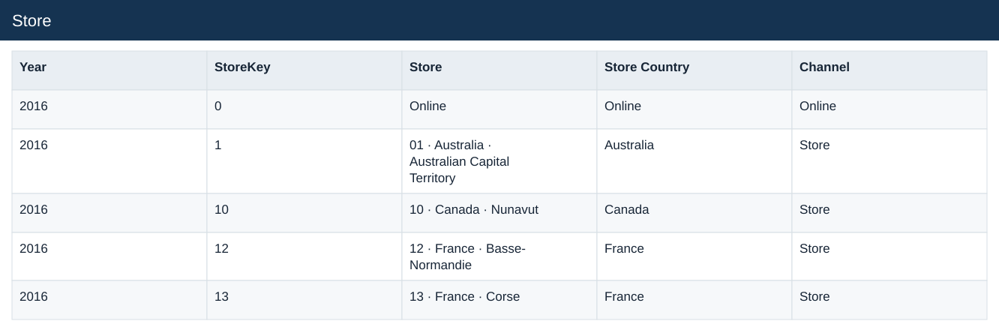
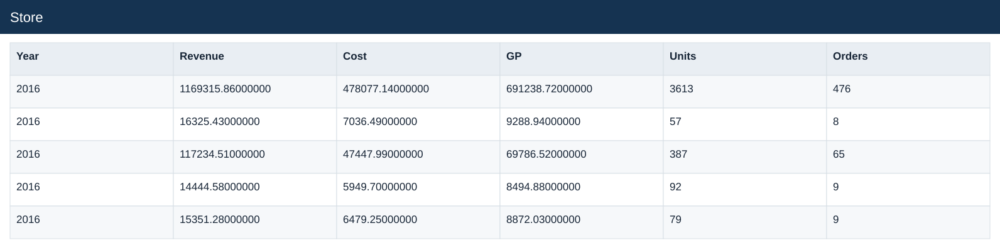
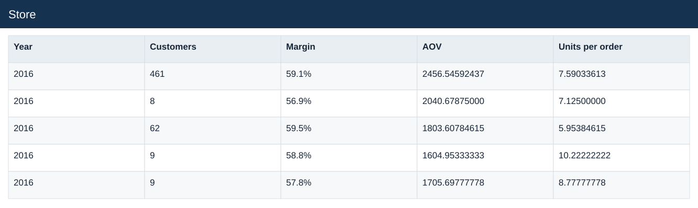

# Store

[Download data](<../outputs/E4_Store.csv>) · [Back to data](../README.md)

## Store

Compare product, store and market contributions.

### Fields

| Field | Meaning | Format | Example |
|---|---|---|---|
| Year | Calendar year. | Number | 2016 |
| StoreKey | — | Number | 0 |
| Store | — | Text | Online |
| Store Country | — | Text | Online |
| Channel | — | Text | Online |
| Revenue | Estimated sales: quantity × static product unit price. | Number | 1169315.86000000 |
| Cost | Quantity × unit product cost. | Number | 478077.14000000 |
| GP | Estimated gross profit: revenue less cost. | Number | 691238.72000000 |
| Units | — | Number | 3613 |
| Orders | — | Number | 476 |
| Customers | — | Number | 461 |
| Margin | Aggregate profit divided by aggregate sales. | Percentage | 59.1% |
| AOV | Revenue divided by distinct orders. | Number | 2456.54592437 |
| Units per order | Total units divided by distinct orders. | Number | 7.59033613 |

