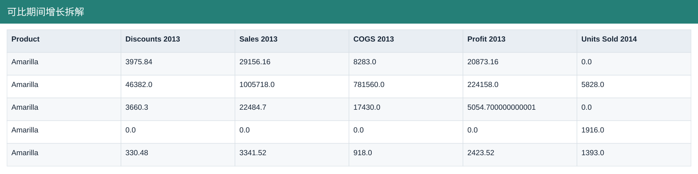
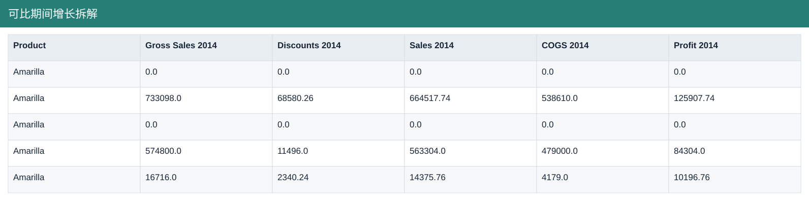
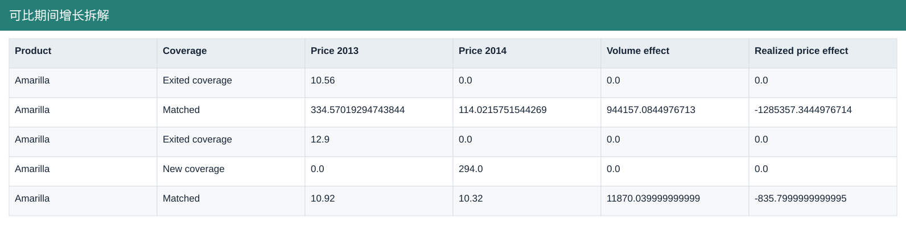
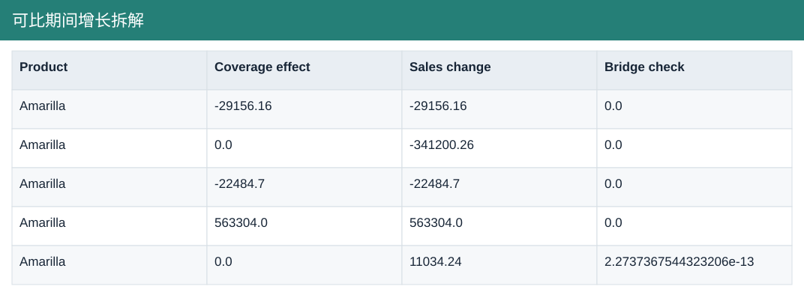

# 可比期间增长拆解

[Download data](<../outputs/F5-F6_可比期间增长拆解.csv>) · [Back to data](../README.md)

## 可比期间增长拆解

Explain growth over equal-length comparable periods.

### Fields

| Field | Meaning | Format | Example |
|---|---|---|---|
| Product | — | Text | Amarilla |
| Country | — | Text | Canada |
| Segment | — | Text | Channel Partners |
| Units Sold 2013 | — | Number | 2761.0 |
| Gross Sales 2013 | — | Number | 33132.0 |
| Discounts 2013 | — | Number | 3975.84 |
| Sales 2013 | — | Number | 29156.16 |
| COGS 2013 | — | Number | 8283.0 |
| Profit 2013 | — | Number | 20873.16 |
| Units Sold 2014 | — | Number | 0.0 |
| Gross Sales 2014 | — | Number | 0.0 |
| Discounts 2014 | — | Number | 0.0 |
| Sales 2014 | — | Number | 0.0 |
| COGS 2014 | — | Number | 0.0 |
| Profit 2014 | — | Number | 0.0 |
| Coverage | Coverage definition for this output; consult the analysis context. | Text | Exited coverage |
| Price 2013 | — | Number | 10.56 |
| Price 2014 | — | Number | 0.0 |
| Volume effect | Matched-combination units change × prior realised price. | Number | 0.0 |
| Realized price effect | Current units × realised-price change. | Number | 0.0 |
| Coverage effect | Sales effect from combinations present in only one compared period. | Number | -29156.16 |
| Sales change | — | Number | -29156.16 |
| Bridge check | Difference between the sum of bridge components and the total change. | Number | 0.0 |

