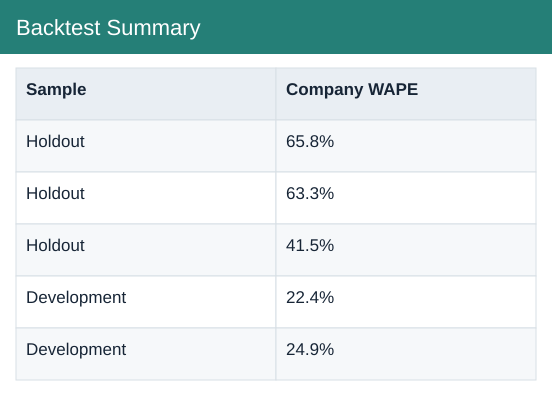

# Backtest Summary

[Download data](<../outputs/FP&A_extensions/F11_Backtest_Summary.csv>) · [Back to data](../README.md)

## Backtest Summary

View the figures used in this analysis.

### Fields

| Field | Format | Example |
|---|---|---|
| Sample | Text | Holdout |
| Method | Text | Last month |
| Observations | Number | 15 |
| WAPE | Percentage | 65.8% |
| Bias | Percentage | -18.8% |
| Company WAPE | Percentage | 65.8% |

