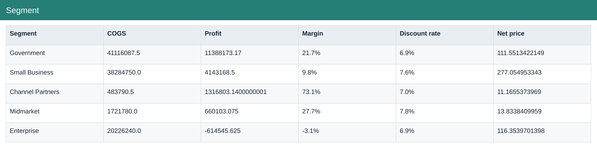

# Segment

[Download data](<../outputs/F3-F4_Segment.csv>) · [Back to data](../README.md)

## Segment

Compare product, country and segment economics.

### Fields

| Field | Meaning | Format | Example |
|---|---|---|---|
| Segment | — | Text | Government |
| Units Sold | Sample units sold; fractional values are preserved. | Number | 470673.5 |
| Gross Sales | Units sold × sale price, before discounts. | Number | 56403066.5 |
| Discounts | Discount amount deducted from gross sales. | Number | 3898805.83 |
| Sales | Net sales after discounts. | Number | 52504260.67 |
| COGS | Cost of goods sold from the source sample. | Number | 41116087.5 |
| Profit | Sales less COGS; not full company net profit. | Number | 11388173.17 |
| Margin | Aggregate profit divided by aggregate sales. | Percentage | 21.7% |
| Discount rate | Total discounts divided by total gross sales. | Percentage | 6.9% |
| Net price | Net sales divided by units sold. | Number | 111.5513422149 |

