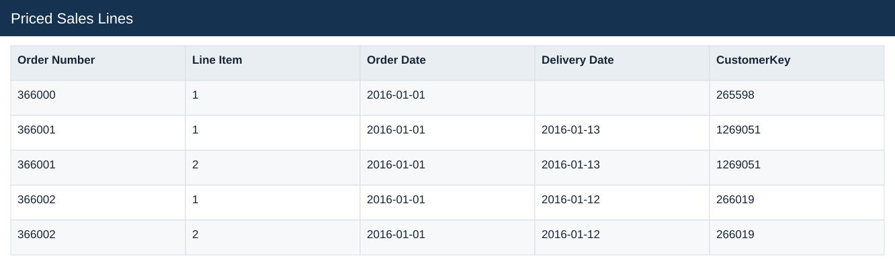
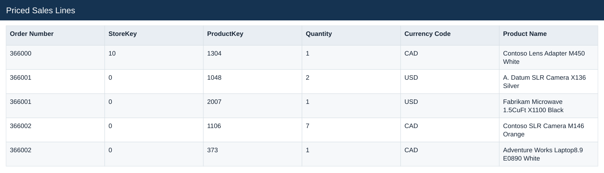
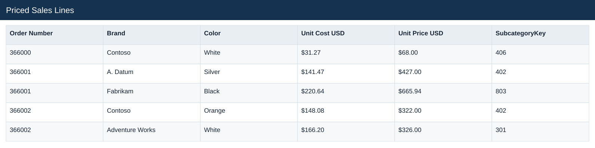
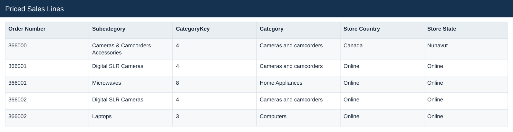
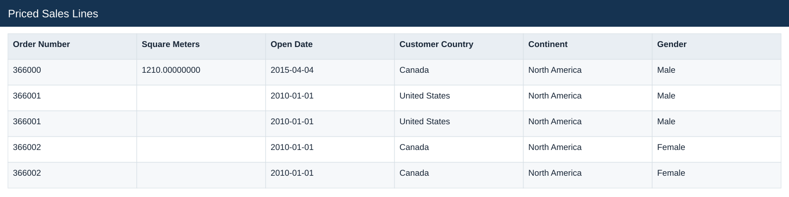
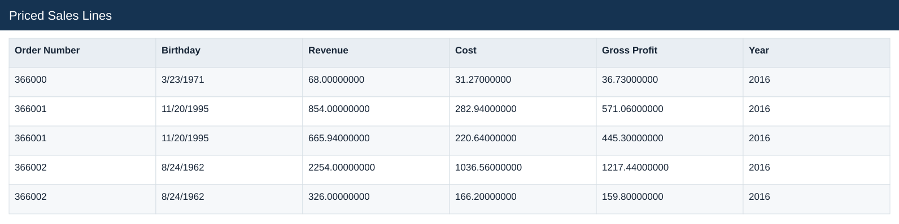
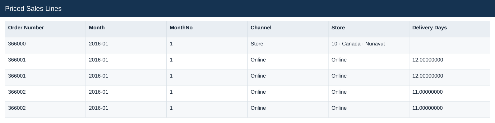
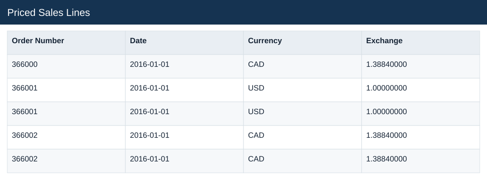

# Priced Sales Lines

[Download data](<../outputs/E2_Priced_Sales_Lines.csv>) · [Back to data](../README.md)

## Priced Sales Lines

Calculate sales, costs and gross profit from quantity and product rates.

### Fields

| Field | Meaning | Format | Example |
|---|---|---|---|
| Order Number | Order identifier; one order can contain several sales lines. | Number | 366000 |
| Line Item | Line identifier within the order. | Number | 1 |
| Order Date | — | Text | 2016-01-01 |
| Delivery Date | — | Text | 2016-01-13 |
| CustomerKey | — | Number | 265598 |
| StoreKey | — | Number | 10 |
| ProductKey | — | Number | 1304 |
| Quantity | Units on the sales line. | Number | 1 |
| Currency Code | — | Text | CAD |
| Product Name | — | Text | Contoso Lens Adapter M450 White |
| Brand | — | Text | Contoso |
| Color | — | Text | White |
| Unit Cost USD | Static product unit cost in USD. | US dollars | $31.27 |
| Unit Price USD | Static product list price in USD. | US dollars | $68.00 |
| SubcategoryKey | — | Number | 406 |
| Subcategory | — | Text | Cameras & Camcorders Accessories |
| CategoryKey | — | Number | 4 |
| Category | — | Text | Cameras and camcorders |
| Store Country | — | Text | Canada |
| Store State | — | Text | Nunavut |
| Square Meters | — | Number | 1210.00000000 |
| Open Date | — | Text | 2015-04-04 |
| Customer Country | — | Text | Canada |
| Continent | — | Text | North America |
| Gender | — | Text | Male |
| Birthday | — | Text | 3/23/1971 |
| Revenue | Estimated sales: quantity × static product unit price. | Number | 68.00000000 |
| Cost | Quantity × unit product cost. | Number | 31.27000000 |
| Gross Profit | Estimated revenue less estimated cost. | Number | 36.73000000 |
| Year | Calendar year. | Number | 2016 |
| Month | Month label or month-start key. | Text | 2016-01 |
| MonthNo | Month number used for chronological sorting. | Number | 1 |
| Channel | — | Text | Store |
| Store | — | Text | 10 · Canada · Nunavut |
| Delivery Days | Delivery date less order date, for valid delivery observations. | Number | 12.00000000 |
| Date | — | Text | 2016-01-01 |
| Currency | — | Text | CAD |
| Exchange | Source exchange-rate factor; preserve the documented direction. | Number | 1.38840000 |

