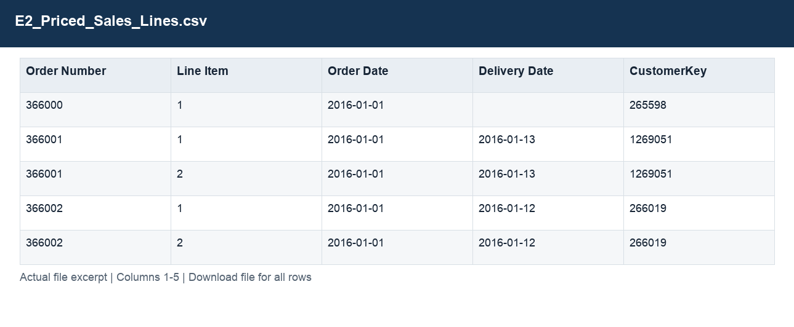
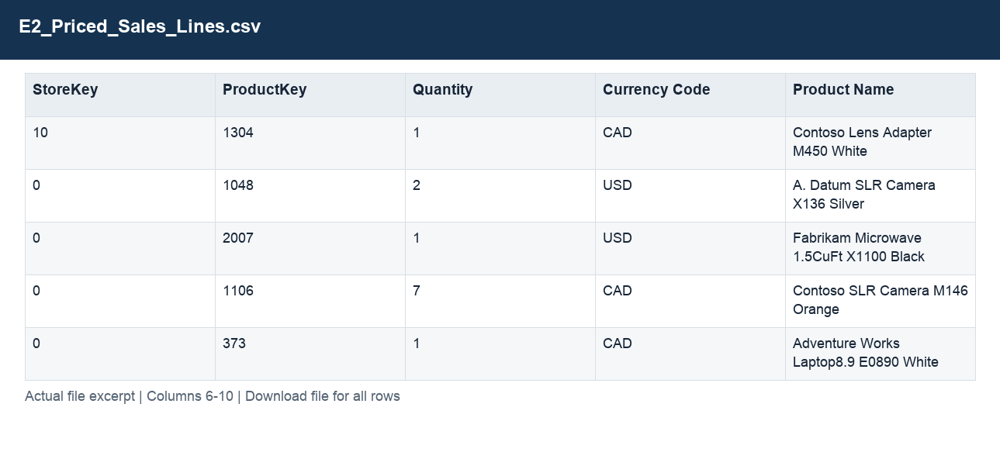
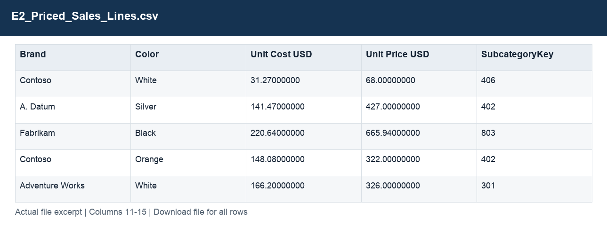
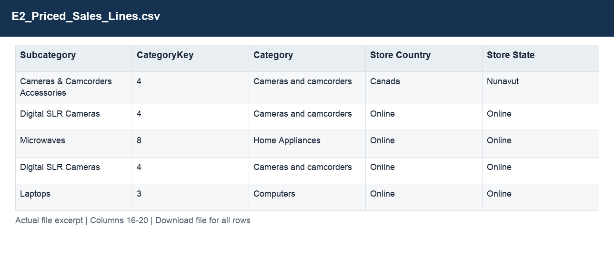
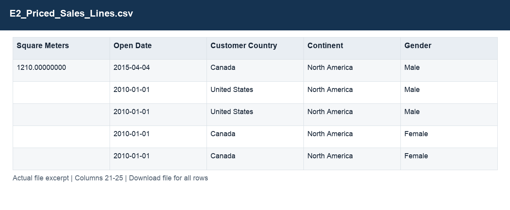
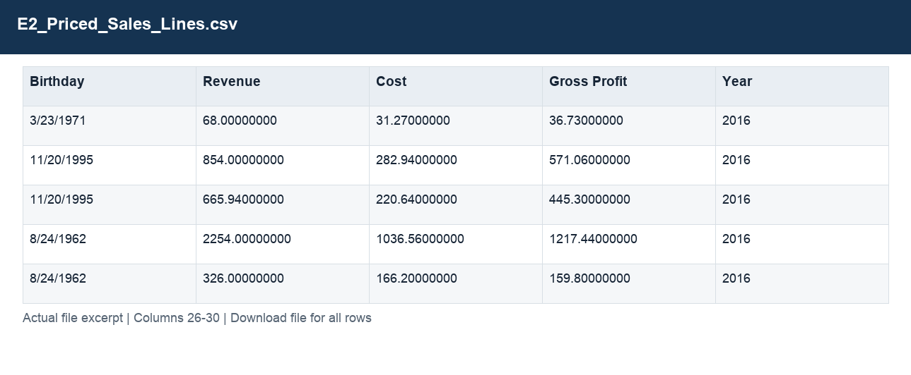
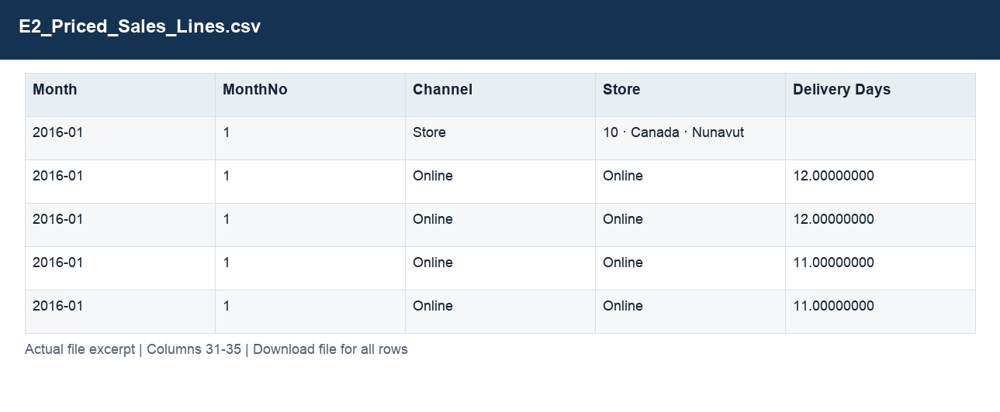
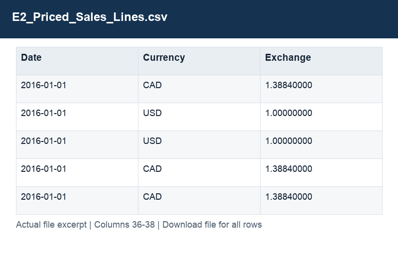

# E2_Priced_Sales_Lines.csv

[Download the complete file](../outputs/E2_Priced_Sales_Lines.csv) · [Back to data guide](../README.md)

**Purpose:** Calculate sales, costs and gross profit from quantity and product rates.

**Rows:** 62,884. **Fields:** 38. CSV files store text; the type rules below describe how to interpret the values during import. The images render the actual first five records, with wide tables split into consecutive column panels. They are data excerpts, not screenshots of the Excel application.

## Fields and formats

| Field | Meaning / use | Import and display | Example |
|---|---|---|---|
| Order Number | Order identifier; one order can contain several sales lines. | Identifier; preserve as text, including leading zeros | 366000 |
| Line Item | Line identifier within the order. | Numeric; preserve full precision, display amount with 2 decimals where applicable | 1 |
| Order Date | Field retained under its source/output label; interpret with the table purpose and displayed example. | Date / period; parse stated order, display YYYY-MM-DD or YYYY-MM | 2016-01-01 |
| Delivery Date | Field retained under its source/output label; interpret with the table purpose and displayed example. | Date / period; parse stated order, display YYYY-MM-DD or YYYY-MM | 2016-01-13 |
| CustomerKey | Join key for the corresponding dimension; retain source values. | Identifier; preserve as text, including leading zeros | 265598 |
| StoreKey | Join key for the corresponding dimension; retain source values. | Identifier; preserve as text, including leading zeros | 10 |
| ProductKey | Join key for the corresponding dimension; retain source values. | Identifier; preserve as text, including leading zeros | 1304 |
| Quantity | Units on the sales line. | Numeric; counts as whole numbers, units/durations retain needed decimals | 1 |
| Currency Code | Grouping, filter or comparison label for currency code. | Identifier; preserve as text, including leading zeros | CAD |
| Product Name | Field retained under its source/output label; interpret with the table purpose and displayed example. | Text / categorical label; preserve spelling and blanks | Contoso Lens Adapter M450 White |
| Brand | Grouping, filter or comparison label for brand. | Text / categorical label; preserve spelling and blanks | Contoso |
| Color | Field retained under its source/output label; interpret with the table purpose and displayed example. | Text / categorical label; preserve spelling and blanks | White |
| Unit Cost USD | Static product unit cost in USD. | Numeric; preserve full precision, display amount with 2 decimals where applicable | 31.27000000 |
| Unit Price USD | Static product list price in USD. | Numeric; preserve full precision, display amount with 2 decimals where applicable | 68.00000000 |
| SubcategoryKey | Join key for the corresponding dimension; retain source values. | Identifier; preserve as text, including leading zeros | 406 |
| Subcategory | Grouping, filter or comparison label for subcategory. | Text / categorical label; preserve spelling and blanks | Cameras & Camcorders Accessories |
| CategoryKey | Join key for the corresponding dimension; retain source values. | Identifier; preserve as text, including leading zeros | 4 |
| Category | Grouping, filter or comparison label for category. | Text / categorical label; preserve spelling and blanks | Cameras and camcorders |
| Store Country | Field retained under its source/output label; interpret with the table purpose and displayed example. | Text / categorical label; preserve spelling and blanks | Canada |
| Store State | Field retained under its source/output label; interpret with the table purpose and displayed example. | Text / categorical label; preserve spelling and blanks | Nunavut |
| Square Meters | Field retained under its source/output label; interpret with the table purpose and displayed example. | Numeric; counts as whole numbers, units/durations retain needed decimals | 1210.00000000 |
| Open Date | Field retained under its source/output label; interpret with the table purpose and displayed example. | Date / period; parse stated order, display YYYY-MM-DD or YYYY-MM | 2015-04-04 |
| Customer Country | Grouping, filter or comparison label for customer country. | Text / categorical label; preserve spelling and blanks | Canada |
| Continent | Field retained under its source/output label; interpret with the table purpose and displayed example. | Text / categorical label; preserve spelling and blanks | North America |
| Gender | Grouping, filter or comparison label for gender. | Text / categorical label; preserve spelling and blanks | Male |
| Birthday | Field retained under its source/output label; interpret with the table purpose and displayed example. | Date / period; parse stated order, display YYYY-MM-DD or YYYY-MM | 3/23/1971 |
| Revenue | Estimated sales: quantity × static product unit price. | Numeric; preserve full precision, display amount with 2 decimals where applicable | 68.00000000 |
| Cost | Quantity × unit product cost. | Numeric; preserve full precision, display amount with 2 decimals where applicable | 31.27000000 |
| Gross Profit | Estimated revenue less estimated cost. | Numeric; preserve full precision, display amount with 2 decimals where applicable | 36.73000000 |
| Year | Calendar year. | Numeric; counts as whole numbers, units/durations retain needed decimals | 2016 |
| Month | Month label or month-start key. | Date / period; parse stated order, display YYYY-MM-DD or YYYY-MM | 2016-01 |
| MonthNo | Month number used for chronological sorting. | Numeric; counts as whole numbers, units/durations retain needed decimals | 1 |
| Channel | Grouping, filter or comparison label for channel. | Text / categorical label; preserve spelling and blanks | Store |
| Store | Grouping, filter or comparison label for store. | Text / categorical label; preserve spelling and blanks | 10 · Canada · Nunavut |
| Delivery Days | Delivery date less order date, for valid delivery observations. | Numeric; counts as whole numbers, units/durations retain needed decimals | 12.00000000 |
| Date | Field retained under its source/output label; interpret with the table purpose and displayed example. | Date / period; parse stated order, display YYYY-MM-DD or YYYY-MM | 2016-01-01 |
| Currency | Field retained under its source/output label; interpret with the table purpose and displayed example. | Text / categorical label; preserve spelling and blanks | CAD |
| Exchange | Source exchange-rate factor; preserve the documented direction. | Numeric; preserve full precision, display amount with 2 decimals where applicable | 1.38840000 |
