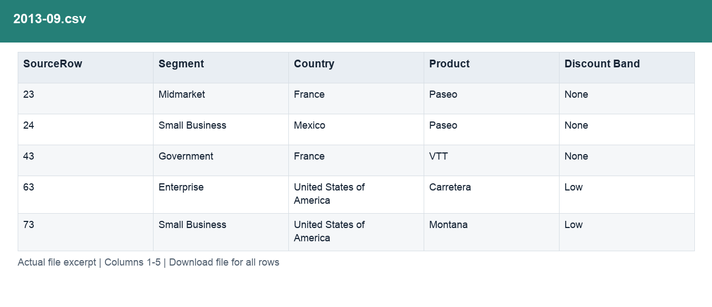
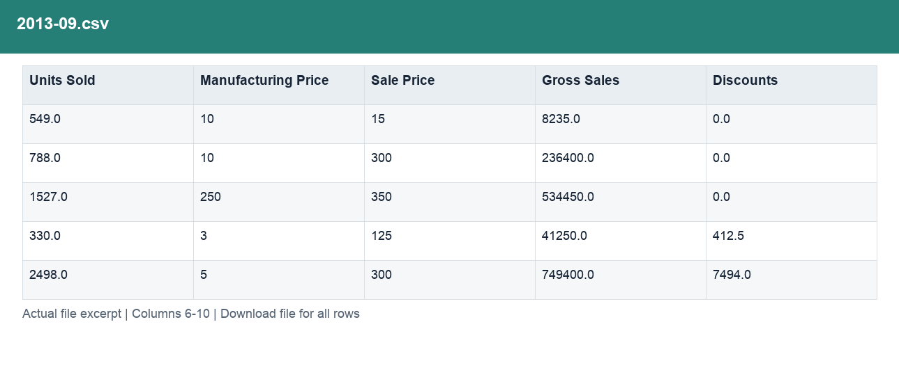
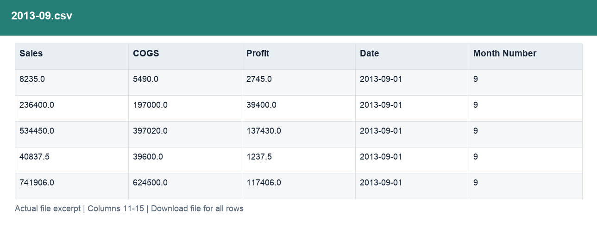
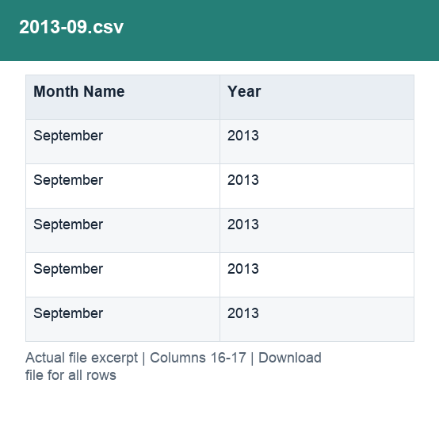

# 2013-09.csv

[Download the complete file](../outputs/F10_月度更新练习/2013-09.csv) · [Back to data guide](../README.md)

**Purpose:** Provide a prepared table for consistent joins, filtering and analysis.

**Rows:** 35. **Fields:** 17. CSV files store text; the type rules below describe how to interpret the values during import. The images render the actual first five records, with wide tables split into consecutive column panels. They are data excerpts, not screenshots of the Excel application.

## Fields and formats

| Field | Meaning / use | Import and display | Example |
|---|---|---|---|
| SourceRow | Traceability row in this sample, not a business transaction ID. | Identifier; preserve as text, including leading zeros | 23 |
| Segment | Grouping, filter or comparison label for segment. | Text / categorical label; preserve spelling and blanks | Midmarket |
| Country | Grouping, filter or comparison label for country. | Text / categorical label; preserve spelling and blanks | France |
| Product | Grouping, filter or comparison label for product. | Text / categorical label; preserve spelling and blanks | Paseo |
| Discount Band | Field retained under its source/output label; interpret with the table purpose and displayed example. | Text / categorical label; preserve spelling and blanks | None |
| Units Sold | Sample units sold; fractional values are preserved. | Numeric; counts as whole numbers, units/durations retain needed decimals | 549.0 |
| Manufacturing Price | Source manufacturing-price field; not a substitute for unit COGS. | Numeric; preserve full precision, display amount with 2 decimals where applicable | 10 |
| Sale Price | Field retained under its source/output label; interpret with the table purpose and displayed example. | Numeric; preserve full precision, display amount with 2 decimals where applicable | 15 |
| Gross Sales | Units sold × sale price, before discounts. | Numeric; preserve full precision, display amount with 2 decimals where applicable | 8235.0 |
| Discounts | Discount amount deducted from gross sales. | Numeric; preserve full precision, display amount with 2 decimals where applicable | 0.0 |
| Sales | Net sales after discounts. | Numeric; preserve full precision, display amount with 2 decimals where applicable | 8235.0 |
| COGS | Cost of goods sold from the source sample. | Numeric; preserve full precision, display amount with 2 decimals where applicable | 5490.0 |
| Profit | Sales less COGS; not full company net profit. | Numeric; preserve full precision, display amount with 2 decimals where applicable | 2745.0 |
| Date | Field retained under its source/output label; interpret with the table purpose and displayed example. | Date / period; parse stated order, display YYYY-MM-DD or YYYY-MM | 2013-09-01 |
| Month Number | Field retained under its source/output label; interpret with the table purpose and displayed example. | Numeric; counts as whole numbers, units/durations retain needed decimals | 9 |
| Month Name | Field retained under its source/output label; interpret with the table purpose and displayed example. | Text / categorical label; preserve spelling and blanks | September |
| Year | Calendar year. | Numeric; counts as whole numbers, units/durations retain needed decimals | 2013 |
