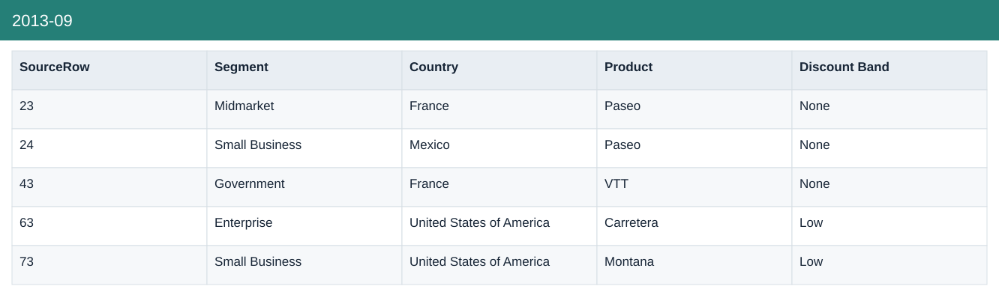
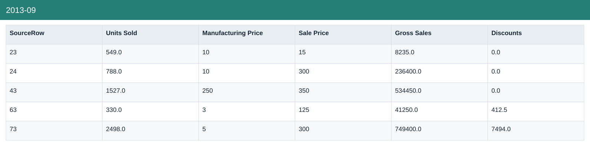
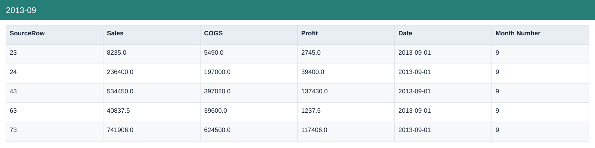
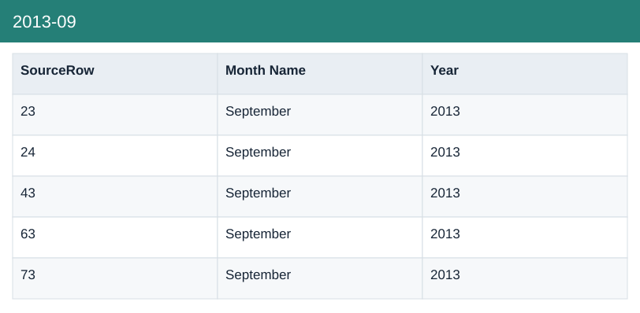

# 2013-09

[Download data](<../outputs/F10_月度更新练习/2013-09.csv>) · [Back to data](../README.md)

## 2013-09

View the budget, actual amounts and calculations.

### Fields

| Field | Meaning | Format | Example |
|---|---|---|---|
| SourceRow | Traceability row in this sample, not a business transaction ID. | Number | 23 |
| Segment | — | Text | Midmarket |
| Country | — | Text | France |
| Product | — | Text | Paseo |
| Discount Band | — | Text | None |
| Units Sold | Sample units sold; fractional values are preserved. | Number | 549.0 |
| Manufacturing Price | Source manufacturing-price field; not a substitute for unit COGS. | Number | 10 |
| Sale Price | — | Number | 15 |
| Gross Sales | Units sold × sale price, before discounts. | Number | 8235.0 |
| Discounts | Discount amount deducted from gross sales. | Number | 0.0 |
| Sales | Net sales after discounts. | Number | 8235.0 |
| COGS | Cost of goods sold from the source sample. | Number | 5490.0 |
| Profit | Sales less COGS; not full company net profit. | Number | 2745.0 |
| Date | — | Text | 2013-09-01 |
| Month Number | — | Number | 9 |
| Month Name | — | Text | September |
| Year | Calendar year. | Number | 2013 |

