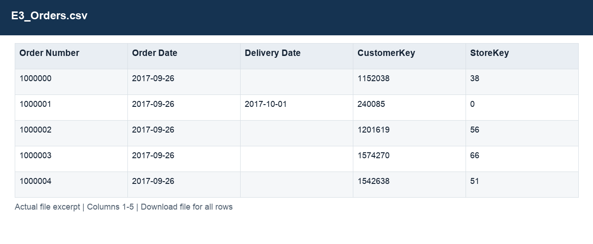
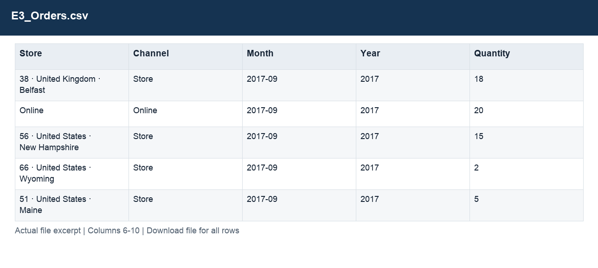
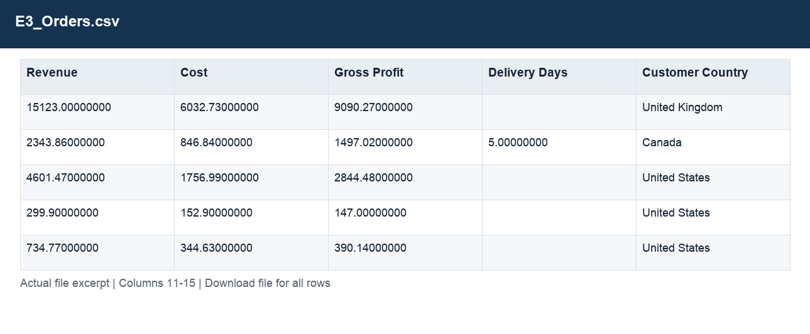
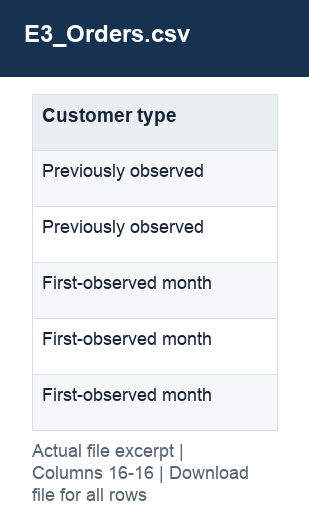

# E3_Orders.csv

[Download the complete file](../outputs/E3_Orders.csv) · [Back to data guide](../README.md)

**Purpose:** Explain order and channel performance over time.

**Rows:** 26,326. **Fields:** 16. CSV files store text; the type rules below describe how to interpret the values during import. The images render the actual first five records, with wide tables split into consecutive column panels. They are data excerpts, not screenshots of the Excel application.

## Fields and formats

| Field | Meaning / use | Import and display | Example |
|---|---|---|---|
| Order Number | Order identifier; one order can contain several sales lines. | Identifier; preserve as text, including leading zeros | 1000000 |
| Order Date | Field retained under its source/output label; interpret with the table purpose and displayed example. | Date / period; parse stated order, display YYYY-MM-DD or YYYY-MM | 2017-09-26 |
| Delivery Date | Field retained under its source/output label; interpret with the table purpose and displayed example. | Date / period; parse stated order, display YYYY-MM-DD or YYYY-MM | 2017-10-01 |
| CustomerKey | Join key for the corresponding dimension; retain source values. | Identifier; preserve as text, including leading zeros | 1152038 |
| StoreKey | Join key for the corresponding dimension; retain source values. | Identifier; preserve as text, including leading zeros | 38 |
| Store | Grouping, filter or comparison label for store. | Text / categorical label; preserve spelling and blanks | 38 · United Kingdom · Belfast |
| Channel | Grouping, filter or comparison label for channel. | Text / categorical label; preserve spelling and blanks | Store |
| Month | Month label or month-start key. | Date / period; parse stated order, display YYYY-MM-DD or YYYY-MM | 2017-09 |
| Year | Calendar year. | Numeric; counts as whole numbers, units/durations retain needed decimals | 2017 |
| Quantity | Units on the sales line. | Numeric; counts as whole numbers, units/durations retain needed decimals | 18 |
| Revenue | Estimated sales: quantity × static product unit price. | Numeric; preserve full precision, display amount with 2 decimals where applicable | 15123.00000000 |
| Cost | Quantity × unit product cost. | Numeric; preserve full precision, display amount with 2 decimals where applicable | 6032.73000000 |
| Gross Profit | Estimated revenue less estimated cost. | Numeric; preserve full precision, display amount with 2 decimals where applicable | 9090.27000000 |
| Delivery Days | Delivery date less order date, for valid delivery observations. | Numeric; counts as whole numbers, units/durations retain needed decimals | 5.00000000 |
| Customer Country | Grouping, filter or comparison label for customer country. | Text / categorical label; preserve spelling and blanks | United Kingdom |
| Customer type | New versus existing buyer classification. | Text / categorical label; preserve spelling and blanks | Previously observed |
