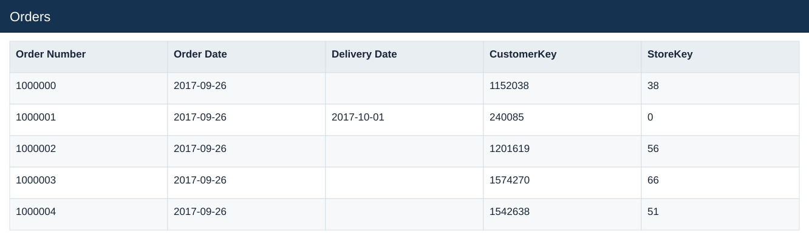
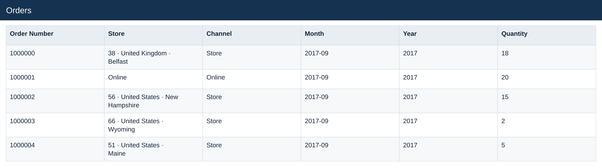
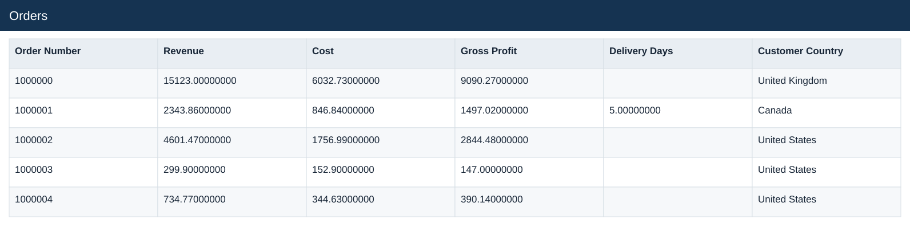
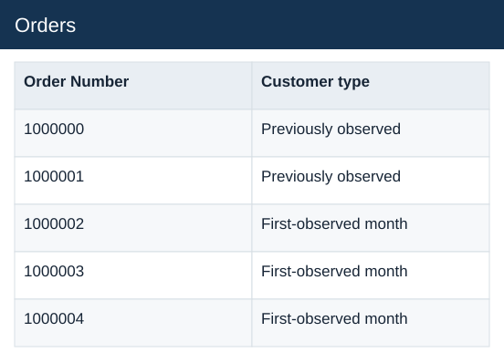

# Orders

[Download data](<../outputs/E3_Orders.csv>) · [Back to data](../README.md)

## Orders

Explain order and channel performance over time.

### Fields

| Field | Meaning | Format | Example |
|---|---|---|---|
| Order Number | Order identifier; one order can contain several sales lines. | Number | 1000000 |
| Order Date | — | Text | 2017-09-26 |
| Delivery Date | — | Text | 2017-10-01 |
| CustomerKey | — | Number | 1152038 |
| StoreKey | — | Number | 38 |
| Store | — | Text | 38 · United Kingdom · Belfast |
| Channel | — | Text | Store |
| Month | Month label or month-start key. | Text | 2017-09 |
| Year | Calendar year. | Number | 2017 |
| Quantity | Units on the sales line. | Number | 18 |
| Revenue | Estimated sales: quantity × static product unit price. | Number | 15123.00000000 |
| Cost | Quantity × unit product cost. | Number | 6032.73000000 |
| Gross Profit | Estimated revenue less estimated cost. | Number | 9090.27000000 |
| Delivery Days | Delivery date less order date, for valid delivery observations. | Number | 5.00000000 |
| Customer Country | — | Text | United Kingdom |
| Customer type | New versus existing buyer classification. | Text | Previously observed |

