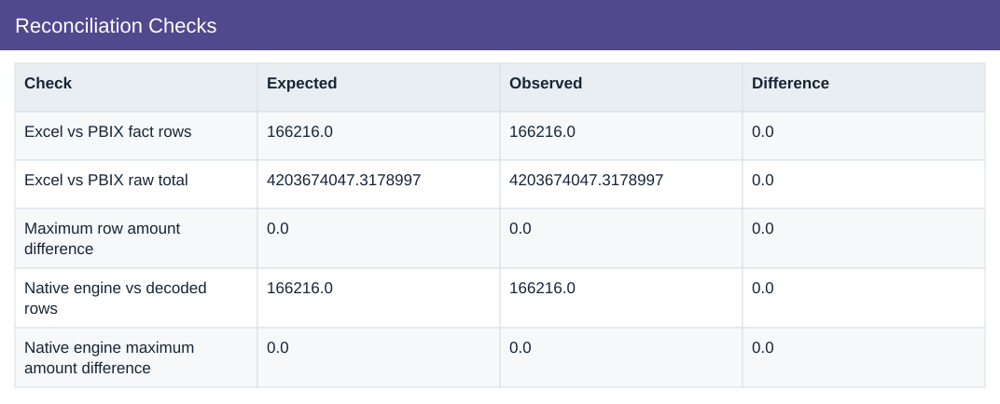

# Reconciliation Checks

[Download data](<../outputs/I1_Reconciliation_Checks.csv>) · [Back to data](../README.md)

## Reconciliation Checks

Validate source extraction and data consistency.

### Fields

| Field | Meaning | Format | Example |
|---|---|---|---|
| Check | Name of the preparation check. | Text | Excel vs PBIX fact rows |
| Expected | Expected total used to check the result. | Number | 166216.0 |
| Observed | Result calculated from the analysis data. | Number | 166216.0 |
| Difference | Observed result less the expected comparison value. | Number | 0.0 |

