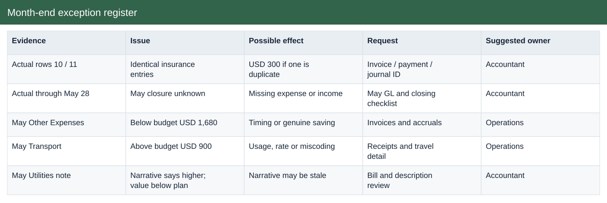
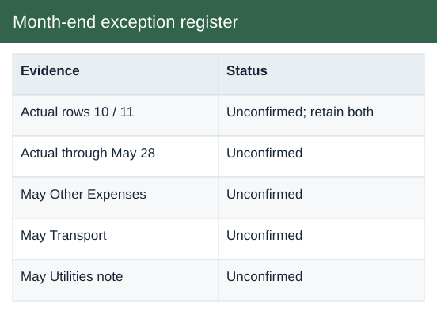

# Month-end exception register

[Download Excel file](<../worksheets/B8_Analysis.xlsx>) · [Back to data](../README.md)

## Month-end exception register

Month-end exception register: a preview of the figures in the workbook.

### Fields

| Field | Format | Example |
|---|---|---|
| Evidence | Text | Actual rows 10 / 11 |
| Issue | Text | Identical insurance entries |
| Possible effect | Text | USD 300 if one is duplicate |
| Request | Text | Invoice / payment / journal ID |
| Suggested owner | Text | Accountant |
| Status | Text | Unconfirmed; retain both |

## Actual

Actual income and expenses recorded by date and category.

### Fields

| Field | Format | Example |
|---|---|---|
| Date | Date | 01 Jan 2022 |
| Category | Text | Rent |
| Type | Text | Expense |
| Description | Text | Store space shared with Mall co-renter |
| Amount USD | US dollars | $7,000.00 |

## Budget

Planned income and expenses by month and category.

### Fields

| Field | Format | Example |
|---|---|---|
| Month no. | Whole number | 1 |
| Category | Text | Sales |
| Type | Text | Income |
| Budget USD | US dollars | $6,000.00 |

