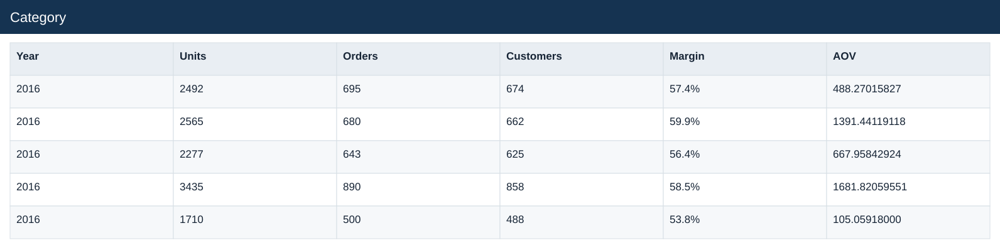
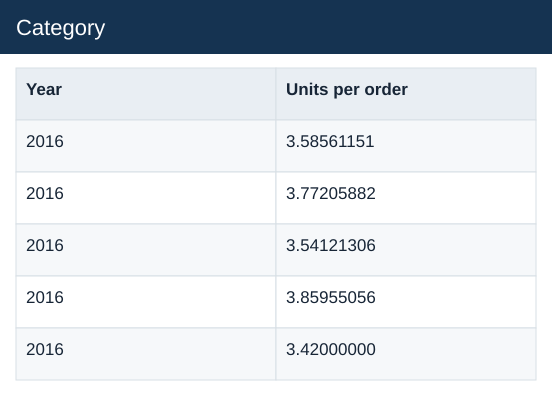

# Category

[Download data](<../outputs/E4_Category.csv>) · [Back to data](../README.md)

## Category

Compare product, store and market contributions.

### Fields

| Field | Meaning | Format | Example |
|---|---|---|---|
| Year | Calendar year. | Number | 2016 |
| Category | — | Text | Audio |
| Revenue | Estimated sales: quantity × static product unit price. | Number | 339347.76000000 |
| Cost | Quantity × unit product cost. | Number | 144487.30000000 |
| GP | Estimated gross profit: revenue less cost. | Number | 194860.46000000 |
| Units | — | Number | 2492 |
| Orders | — | Number | 695 |
| Customers | — | Number | 674 |
| Margin | Aggregate profit divided by aggregate sales. | Percentage | 57.4% |
| AOV | Revenue divided by distinct orders. | Number | 488.27015827 |
| Units per order | Total units divided by distinct orders. | Number | 3.58561151 |

