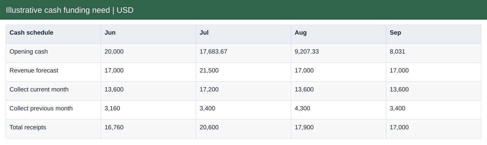
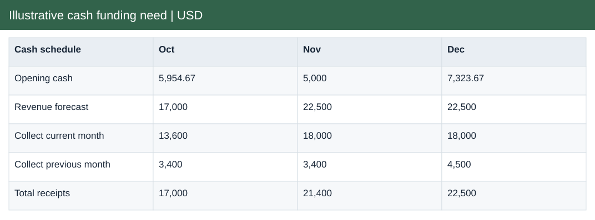
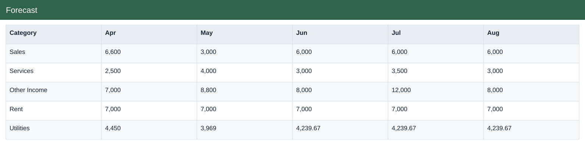
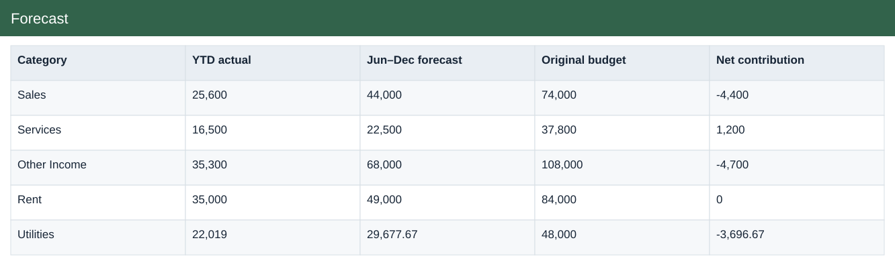

# Illustrative cash funding need | USD

[Download Excel file](<../worksheets/B10_Analysis.xlsx>) · [Back to data](../README.md)

## Illustrative cash funding need | USD

Illustrative cash funding need | USD: a preview of the figures in the workbook.

### Fields

| Field | Format | Example |
|---|---|---|
| Cash schedule | Text | Opening cash |
| Jun | Whole number | 20,000 |
| Jul | Number (2 decimals) | 17,683.67 |
| Aug | Number (2 decimals) | 9,207.33 |
| Sep | Number (2 decimals) | 8,031 |
| Oct | Number (2 decimals) | 5,954.67 |
| Nov | Whole number | 5,000 |
| Dec | Number (2 decimals) | 7,323.67 |

## Forecast

Forecast: a preview of the figures in the workbook.

### Fields

| Field | Format | Example |
|---|---|---|
| Category | Text | Sales |
| Type | Text | Income |
| Jan | Whole number | 5,000 |
| Feb | Whole number | 3,000 |
| Mar | Whole number | 8,000 |
| Apr | Whole number | 6,600 |
| May | Whole number | 3,000 |
| Jun | Whole number | 6,000 |
| Jul | Whole number | 6,000 |
| Aug | Whole number | 6,000 |
| Sep | Whole number | 6,000 |
| Oct | Whole number | 6,000 |
| Nov | Whole number | 7,000 |
| Dec | Whole number | 7,000 |
| Full year | Whole number | 69,600 |
| YTD actual | Whole number | 25,600 |
| Jun–Dec forecast | Whole number | 44,000 |
| Original budget | Whole number | 74,000 |
| Net contribution | Whole number | -4,400 |

## Actual

Actual income and expenses recorded by date and category.

### Fields

| Field | Format | Example |
|---|---|---|
| Date | Date | 01 Jan 2022 |
| Month no. | Whole number | 1 |
| Category | Text | Rent |
| Type | Text | Expense |
| Description | Text | Store space shared with Mall co-renter |
| Amount USD | US dollars | $7,000.00 |

## Budget

Planned income and expenses by month and category.

### Fields

| Field | Format | Example |
|---|---|---|
| Month no. | Whole number | 1 |
| Category | Text | Sales |
| Type | Text | Income |
| Budget USD | US dollars | $6,000.00 |

