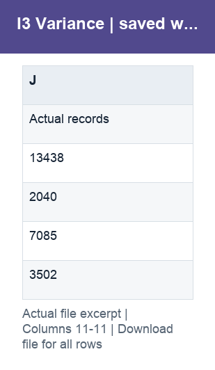
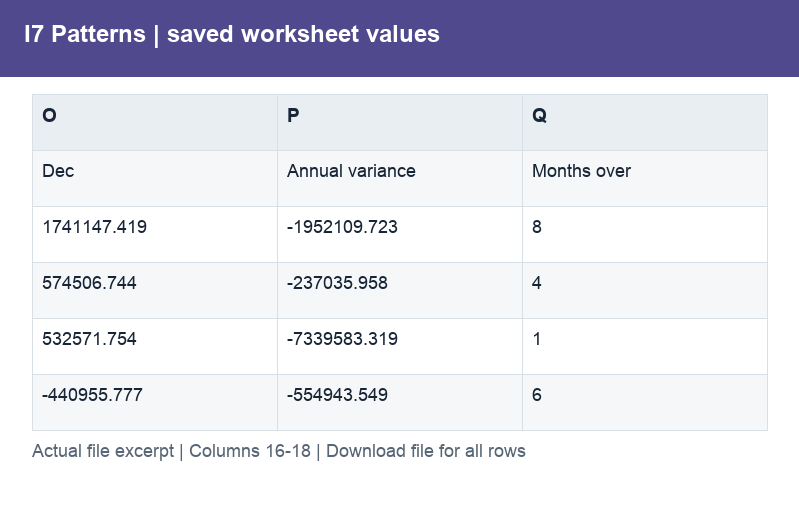
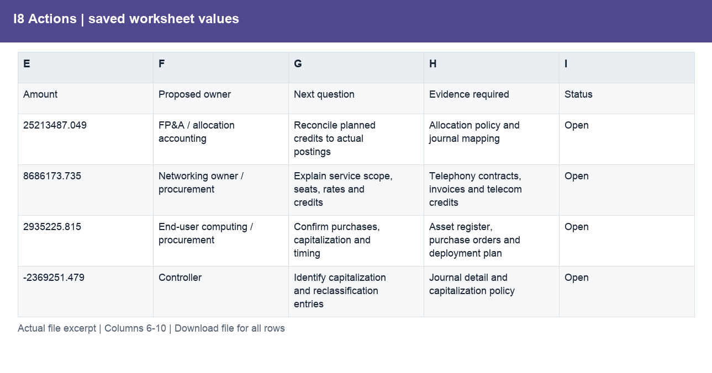
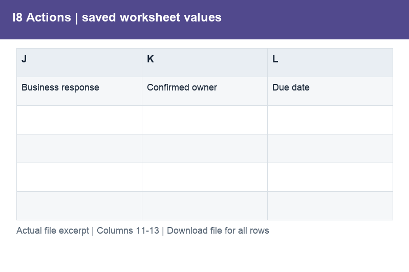
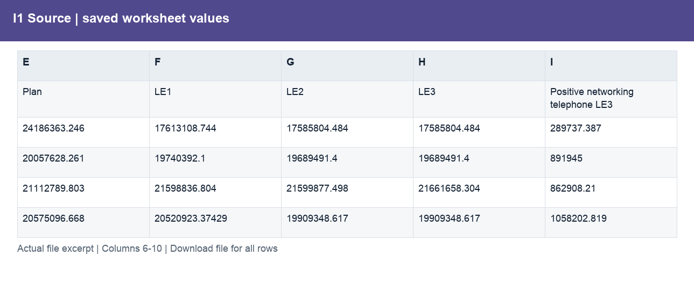

# Analysis.xlsx

[Download workbook](../worksheets/Analysis.xlsx) · [Back to data guide](../README.md)

This page renders saved cell values from the actual workbook. Excel workbooks mix schedules, assumptions and tables, so formats are documented by worksheet and column rather than treating the whole file as one dataset. No calculations or source cells were changed for these illustrations.

## I2 Overview

Measure spend against plan by month.

| Column | Labels / sample content | Stored type and Excel number format |
|---|---|---|
| A | Numeric schedule values | ;  |
| B | Numeric schedule values | ;  |
| C | I2. IT spending overview; 2014. Sample reporting dollars (raw value × 0.3). obviEnce ©.; Actual spend | float, str; #,##0;(#,##0);–; General |
| D | Plan spend; Actual | float, str; #,##0;(#,##0);–; General |
| E | Overspend; Plan | float, str; #,##0;(#,##0);–; General |
| F | Overspend %; Variance | float, str; #,##0;(#,##0);–; 0.0%;(0.0%);–; General |
| G | Variance % | float, str; 0.0%;(0.0%);–; General |
| H | YTD actual | float, str; #,##0;(#,##0);–; General |
| I | YTD variance | float, str; #,##0;(#,##0);–; General |

Column labels may change between sections lower in the worksheet. Download the workbook to follow those schedules and formulas; the illustration shows only the opening populated section.

## I9 Inputs

Provide a prepared table for consistent joins, filtering and analysis.

| Column | Labels / sample content | Stored type and Excel number format |
|---|---|---|
| A | Numeric schedule values | ;  |
| B | Numeric schedule values | ;  |
| C | I9. Illustrative telephone cost proposal; 2014. Sample reporting dollars (raw value × 0.3). obviEnce ©.; Case selected (1 or 2) | str; General |
| D | Active selection | float, int, str; #,##0;(#,##0);–; 0.0%;(0.0%);–; General |
| E | No action | int, str; #,##0;(#,##0);–; 0.0%;(0.0%);–; General |
| F | Proposal | float, int, str; #,##0;(#,##0);–; 0.0%;(0.0%);–; General |
| G | Unapproved proposal | str; General |

Column labels may change between sections lower in the worksheet. Download the workbook to follow those schedules and formulas; the illustration shows only the opening populated section.

## I10 Forecast

Combine closed actuals with remaining estimates and scenario actions.

| Column | Labels / sample content | Stored type and Excel number format |
|---|---|---|
| A | Numeric schedule values | ;  |
| B | Numeric schedule values | ;  |
| C | I10. September rolling forecast simulation; 2014. Sample reporting dollars (raw value × 0.3). obviEnce ©.; Case selected | float, str; #,##0;(#,##0);–; General |
| D | Remaining LE3; Closed actual | float, str; #,##0;(#,##0);–; General |
| E | Unapproved proposal; Baseline outlook; Plan | float, str; #,##0;(#,##0);–; General |
| F | Net proposal saving; Remaining LE3 | float, int, str; #,##0;(#,##0);–; General |
| G | Active outlook; Baseline | float, str; #,##0;(#,##0);–; General |
| H | Vs annual plan; Eligible telephone | float, int, str; #,##0;(#,##0);–; General |

Column labels may change between sections lower in the worksheet. Download the workbook to follow those schedules and formulas; the illustration shows only the opening populated section.

## I3 Variance

Provide a prepared table for consistent joins, filtering and analysis.

| Column | Labels / sample content | Stored type and Excel number format |
|---|---|---|
| A | Numeric schedule values | ;  |
| B | Numeric schedule values | ;  |
| C | I3. Where is spend above plan?; 2014. Sample reporting dollars (raw value × 0.3). obviEnce ©.; IT Area | str; General |
| D | Actual; Actual; n.a. | float, str; #,##0;(#,##0);–; General |
| E | Plan; Plan; Plan | float, int, str; #,##0;(#,##0);–; General |
| F | Variance; Variance; Variance | float, str; #,##0;(#,##0);–; General |
| G | Variance %; Variance %; n.m. | float, str; 0.0%;(0.0%);–; General |
| H | LE3; LE3; LE3 | float, str; #,##0;(#,##0);–; General |
| I | Vs LE3; Vs LE3; Vs LE3 | float, str; #,##0;(#,##0);–; General |
| J | Actual records; Actual records; Actual records | int, str; General |

Column labels may change between sections lower in the worksheet. Download the workbook to follow those schedules and formulas; the illustration shows only the opening populated section.

## I4 Drivers

Trace material cost variances to reviewable drivers.

| Column | Labels / sample content | Stored type and Excel number format |
|---|---|---|
| A | Numeric schedule values | ;  |
| B | Numeric schedule values | ;  |
| C | I4. Trace the largest adverse drivers; 2014. Sample reporting dollars (raw value × 0.3). obviEnce ©.; IT area | str; General |
| D | Subarea; Core Infrastructure; Networking | str; General |
| E | Cost element; Administrative Other; Telephone | str; General |
| F | Actual; n.a.; n.a. | float, str; #,##0;(#,##0);–; General |
| G | Plan | float, int, str; #,##0;(#,##0);–; General |
| H | Variance | float, int, str; #,##0;(#,##0);–; General |
| I | LE3 | float, int, str; #,##0;(#,##0);–; General |
| J | Evidence status; Cause unconfirmed; Cause unconfirmed | str; General |

Column labels may change between sections lower in the worksheet. Download the workbook to follow those schedules and formulas; the illustration shows only the opening populated section.

## I5-I6 Estimates

Compare estimate versions and diagnose overlap with actuals.

| Column | Labels / sample content | Stored type and Excel number format |
|---|---|---|
| A | Numeric schedule values | ;  |
| B | Numeric schedule values | ;  |
| C | I5–I6. Estimate revisions and error diagnostics; 2014. Sample reporting dollars (raw value × 0.3). obviEnce ©.; Version | str; General |
| D | Annual amount; Actual | float, str; #,##0;(#,##0);–; General |
| E | Revision vs Plan; Plan | float, int, str; #,##0;(#,##0);–; General |
| F | Actual less version; LE1 | float, str; #,##0;(#,##0);–; General |
| G | Sum monthly abs error; LE2 | float, str; #,##0;(#,##0);–; General |
| H | Monthly WAPE; LE3 | float, str; #,##0;(#,##0);–; 0.0%;(0.0%);–; General |
| I | Actual-matching months; Abs Plan error | float, int, str; #,##0;(#,##0);–; General |

Column labels may change between sections lower in the worksheet. Download the workbook to follow those schedules and formulas; the illustration shows only the opening populated section.

## I7 Patterns

Distinguish recurring variance patterns from monthly offsets.

| Column | Labels / sample content | Stored type and Excel number format |
|---|---|---|
| A | Numeric schedule values | ;  |
| B | Numeric schedule values | ;  |
| C | I7. Persistent cost or timing difference?; 2014. Sample reporting dollars (raw value × 0.3). obviEnce ©.; IT area | str; General |
| D | Jan | float, str; #,##0,,.00"M";(#,##0,,.00"M");–; General |
| E | Feb | float, str; #,##0,,.00"M";(#,##0,,.00"M");–; General |
| F | Mar | float, str; #,##0,,.00"M";(#,##0,,.00"M");–; General |
| G | Apr | float, str; #,##0,,.00"M";(#,##0,,.00"M");–; General |
| H | May | float, str; #,##0,,.00"M";(#,##0,,.00"M");–; General |
| I | Jun | float, str; #,##0,,.00"M";(#,##0,,.00"M");–; General |
| J | Jul | float, str; #,##0,,.00"M";(#,##0,,.00"M");–; General |
| K | Aug | float, str; #,##0,,.00"M";(#,##0,,.00"M");–; General |
| L | Sep | float, str; #,##0,,.00"M";(#,##0,,.00"M");–; General |
| M | Oct | float, str; #,##0,,.00"M";(#,##0,,.00"M");–; General |
| N | Nov | float, str; #,##0,,.00"M";(#,##0,,.00"M");–; General |
| O | Dec | float, str; #,##0,,.00"M";(#,##0,,.00"M");–; General |
| P | Annual variance | float, str; #,##0,,.00"M";(#,##0,,.00"M");–; General |
| Q | Months over | int, str; General |

Column labels may change between sections lower in the worksheet. Download the workbook to follow those schedules and formulas; the illustration shows only the opening populated section.

## I8 Actions

Prepare specific evidence requests for budget-owner review.

| Column | Labels / sample content | Stored type and Excel number format |
|---|---|---|
| A | Numeric schedule values | ;  |
| B | Numeric schedule values | ;  |
| C | I8. Budget-owner review and follow-up; 2014. Sample reporting dollars (raw value × 0.3). obviEnce ©.; ID | str; General |
| D | Topic; Administrative plan credits; Networking telephone | str; General |
| E | Amount | float, str; #,##0;(#,##0);–; General |
| F | Proposed owner; FP&A / allocation accounting; Networking owner / procurement | str; General |
| G | Next question; Reconcile planned credits to actual postings; Explain service scope, seats, rates and credits | str; General |
| H | Evidence required; Allocation policy and journal mapping; Telephony contracts, invoices and telecom credits | str; General |
| I | Status; Open; Open | str; General |
| J | Business response | str; General |
| K | Confirmed owner | str; General |
| L | Due date | str; General |

Column labels may change between sections lower in the worksheet. Download the workbook to follow those schedules and formulas; the illustration shows only the opening populated section.

## I1 Source

Validate source extraction and data consistency.

| Column | Labels / sample content | Stored type and Excel number format |
|---|---|---|
| A | Numeric schedule values | ;  |
| B | Numeric schedule values | ;  |
| C | I1. Source data and reconciliation; 2014. Sample reporting dollars (raw value × 0.3). obviEnce ©.; Month | str; General |
| D | Actual; Member; BU Support | float, str; #,##0;(#,##0);–; General |
| E | Plan; Actual | float, str; #,##0;(#,##0);–; General |
| F | LE1; Plan | float, str; #,##0;(#,##0);–; General |
| G | LE2; LE1 | float, str; #,##0;(#,##0);–; General |
| H | LE3; LE2 | float, str; #,##0;(#,##0);–; General |
| I | Positive networking telephone LE3; LE3 | float, int, str; #,##0;(#,##0);–; General |

Column labels may change between sections lower in the worksheet. Download the workbook to follow those schedules and formulas; the illustration shows only the opening populated section.

