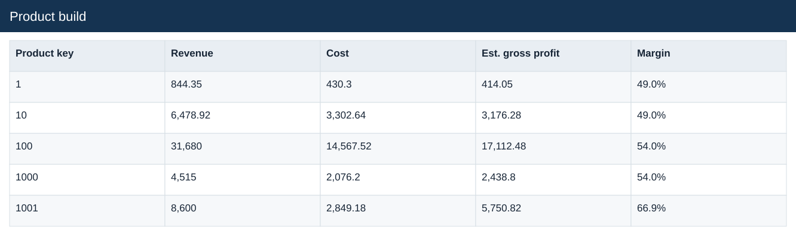
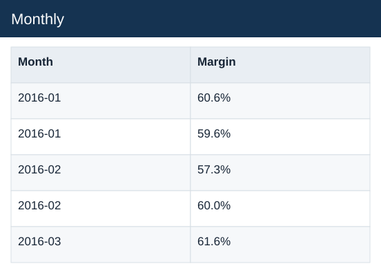
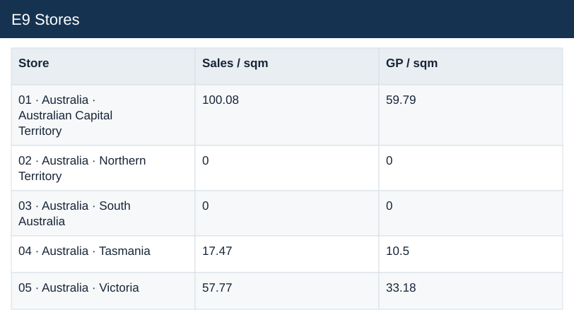

# Overview

[Download Excel file](<../worksheets/Analysis.xlsx>) · [Back to data](../README.md)

## Overview

Overview: a preview of the figures in the workbook.

### Fields

| Field | Format | Example |
|---|---|---|
| Metric | Text | Estimated sales |
| 2019 | Number (2 decimals) | 18,264,382.48 |
| 2020 | Number (2 decimals) | 9,294,632.14 |
| Change | Number (2 decimals) | -0.49 |

## Product build

Product build: a preview of the figures in the workbook.

### Fields

| Field | Format | Example |
|---|---|---|
| Product key | Number | 1 |
| Product name | Text | Contoso 512MB MP3 Player E51 Silver |
| Units | Whole number | 65 |
| List price USD | US dollars | $12.99 |
| Unit cost USD | US dollars | $6.62 |
| Revenue | Number (2 decimals) | 844.35 |
| Cost | Number (2 decimals) | 430.3 |
| Est. gross profit | Number (2 decimals) | 414.05 |
| Margin | Percentage | 49.0% |

## Monthly

Monthly: a preview of the figures in the workbook.

### Fields

| Field | Format | Example |
|---|---|---|
| Month | Text | 2016-01 |
| Year | Whole number | 2,016 |
| Channel | Text | Online |
| Est. sales | Number (2 decimals) | 68,194.13 |
| Cost | Number (2 decimals) | 26,890.69 |
| Est. gross profit | Number (2 decimals) | 41,303.44 |
| Orders | Whole number | 43 |
| Units | Whole number | 299 |
| AOV | Number (2 decimals) | 1,585.91 |
| Units / order | Number (2 decimals) | 6.95 |
| Margin | Percentage | 60.6% |

## Categories

Categories: a preview of the figures in the workbook.

### Fields

| Field | Format | Example |
|---|---|---|
| Year | Whole number | 2,016 |
| Category | Text | Audio |
| Est. sales | Number (2 decimals) | 339,347.76 |
| Cost | Number (2 decimals) | 144,487.3 |
| Est. gross profit | Number (2 decimals) | 194,860.46 |
| Units | Whole number | 2,492 |
| Orders | Whole number | 695 |
| Margin | Percentage | 57.4% |

## E9 Stores

E9 Stores: a preview of the figures in the workbook.

### Fields

| Field | Format | Example |
|---|---|---|
| Store | Text | 01 · Australia · Australian Capital Territory |
| Coverage group | Text | Established, incomplete monthly coverage |
| Area sqm | Whole number | 595 |
| Months 2019 | Whole number | 12 |
| Months 2020 | Whole number | 9 |
| Est. sales 2019 | Number (2 decimals) | 83,345.18 |
| Est. sales 2020 | Number (2 decimals) | 59,547.84 |
| Est. GP 2020 | Number (2 decimals) | 35,576.51 |
| Change | Number (2 decimals) | -23,797.34 |
| Growth | Percentage | -28.6% |
| Sales / sqm | Number (2 decimals) | 100.08 |
| GP / sqm | Number (2 decimals) | 59.79 |

## Cohorts

Cohorts: a preview of the figures in the workbook.

### Fields

| Field | Format | Example |
|---|---|---|
| Cohort | Text | 2016-01 |
| Customers | Whole number | 289 |
| Eligible90 | Whole number | 289 |
| Repeat90 | Whole number | 13 |
| 90-day repeat rate | Percentage | 4.5% |

## Delivery

Delivery: a preview of the figures in the workbook.

### Fields

| Field | Format | Example |
|---|---|---|
| Year | Whole number | 2,016 |
| Channel | Text | Online |
| Orders | Whole number | 476 |
| Valid | Whole number | 476 |
| Coverage | Whole number | 1 |
| MeanDays | Number (2 decimals) | 7.17 |
| MedianDays | Whole number | 7 |
| P90Days | Whole number | 11 |
| Over7 | Whole number | 201 |
| Share over 7 days | Percentage | 42.2% |

## Drivers

Drivers: a preview of the figures in the workbook.

### Fields

| Field | Format | Example |
|---|---|---|
| Metric | Text | Est. sales |
| 2019 | Number (2 decimals) | 18,264,382.48 |
| 2020 | Number (2 decimals) | 9,294,632.14 |

## E10 Checks

E10 Checks: a preview of the figures in the workbook.

### Fields

| Field | Format | Example |
|---|---|---|
| Check | Text | Duplicate sales order-line keys |
| Observed | Whole number | 0 |
| Expected | Whole number | 0 |
| Difference | Whole number | 0 |

