# Analysis.xlsx

[Download workbook](../worksheets/Analysis.xlsx) · [Back to data guide](../README.md)

This page renders saved cell values from the actual workbook. Excel workbooks mix schedules, assumptions and tables, so formats are documented by worksheet and column rather than treating the whole file as one dataset. No calculations or source cells were changed for these illustrations.

## Overview

Provide a prepared table for consistent joins, filtering and analysis.

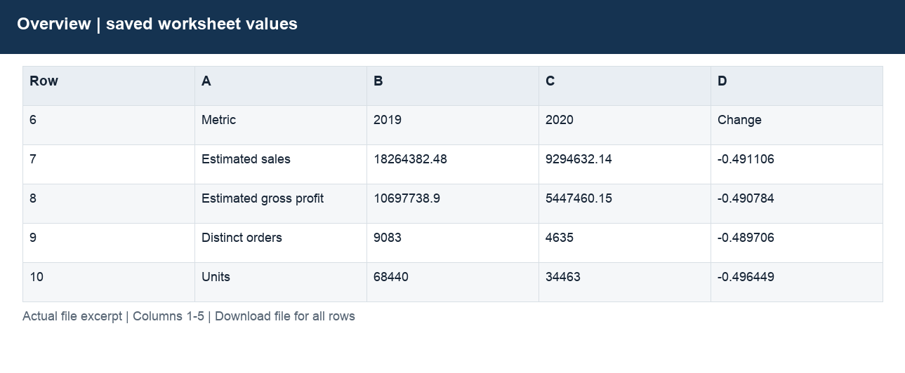

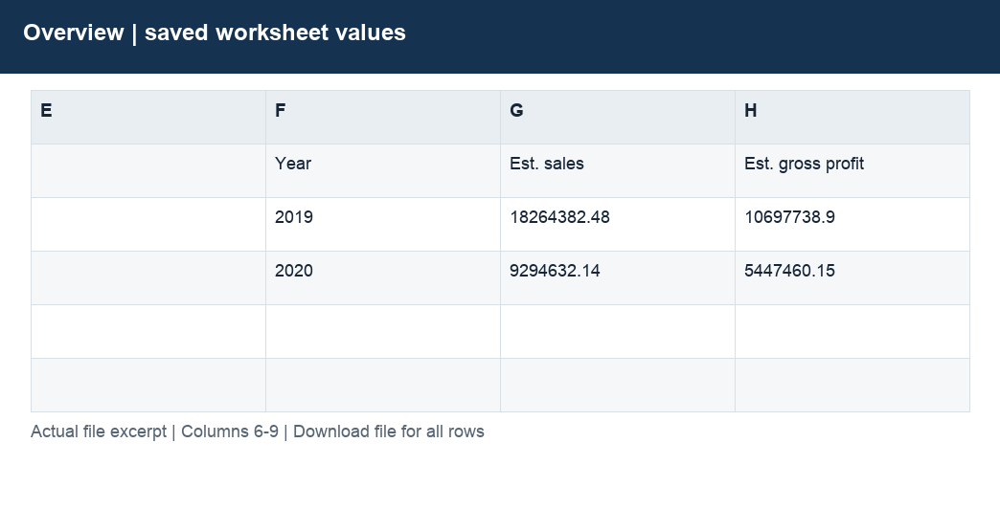

| Column | Labels / sample content | Stored type and Excel number format |
|---|---|---|
| A | Global Electronics Retailer  /  Finance review; 2020 vs 2019. Estimated amounts in USD using static product list prices and unit costs.; Metric | str; General |
| B | 2019 | float, int, str; #,##0;(#,##0);–; 0.0%;(0.0%);–; General |
| C | 2020 | float, int, str; #,##0;(#,##0);–; 0.0%;(0.0%);–; General |
| D | Change | float, str; 0.0%;(0.0%);–; 0.00" pp"; General |
| E | Numeric schedule values | ;  |
| F | Year; 2019; 2020 | str; General |
| G | Est. sales | float, str; #,##0;(#,##0);–; General |
| H | Est. gross profit | float, str; #,##0;(#,##0);–; General |

Column labels may change between sections lower in the worksheet. Download the workbook to follow those schedules and formulas; the illustration shows only the opening populated section.

## E2 Product build

Calculate sales, costs and gross profit from quantity and product rates.

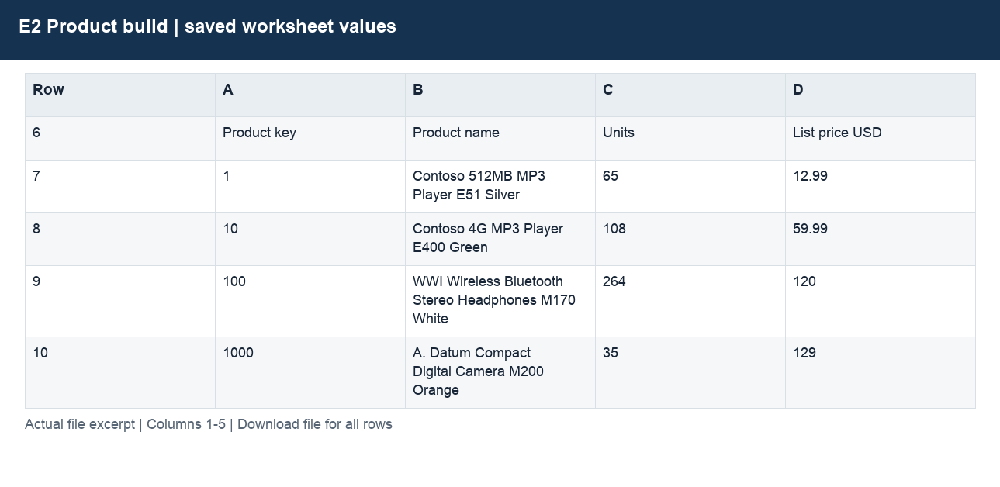

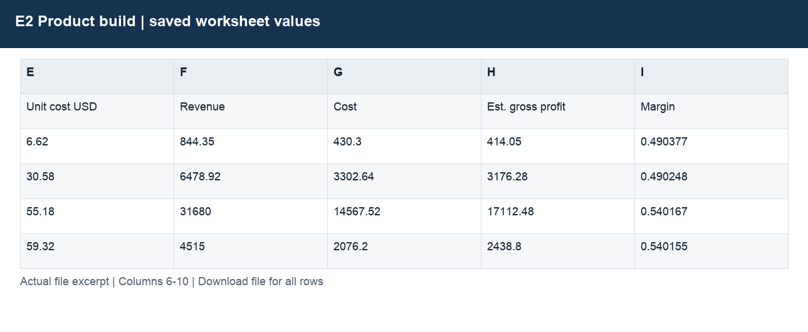

| Column | Labels / sample content | Stored type and Excel number format |
|---|---|---|
| A | E2. Quantity × product list price (USD); Products.csv + aggregated Sales quantity. No actual transaction prices.; Source: github.com/DimitriKneur/Global-Electronics-Retailer-Analysis/0_Data_Sources | str; @; General |
| B | Product name; Contoso 512MB MP3 Player E51 Silver; Contoso 4G MP3 Player E400 Green | str; #,##0;(#,##0);–; General |
| C | Units | int, str; #,##0;(#,##0);–; General |
| D | List price USD | float, int, str; 0.00; General |
| E | Unit cost USD | float, str; 0.00; General |
| F | Revenue | float, int, str; #,##0;(#,##0);–; General |
| G | Cost | float, str; #,##0;(#,##0);–; General |
| H | Est. gross profit | float, str; #,##0;(#,##0);–; General |
| I | Margin | float, str; 0.0%;(0.0%);–; General |

Column labels may change between sections lower in the worksheet. Download the workbook to follow those schedules and formulas; the illustration shows only the opening populated section.

## E3 Monthly

Explain order and channel performance over time.

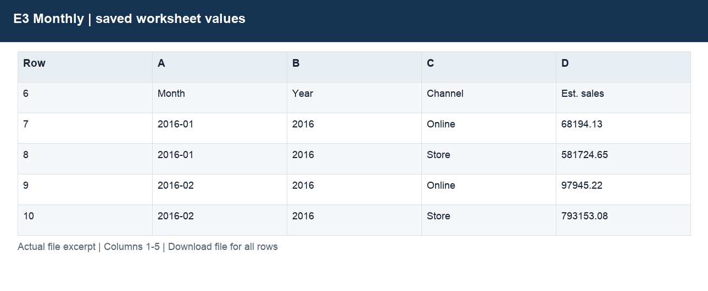

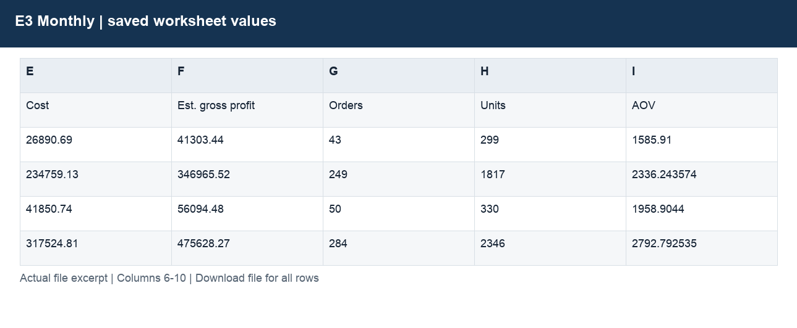

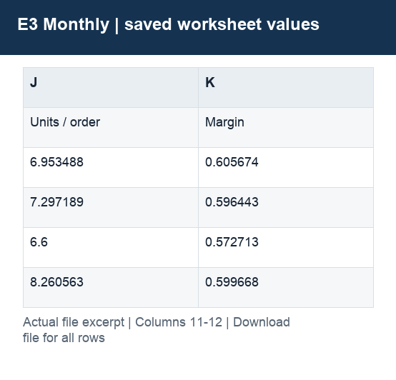

| Column | Labels / sample content | Stored type and Excel number format |
|---|---|---|
| A | E3. Monthly channel performance (USD); Prepared monthly sums from E2_Priced_Sales_Lines.csv. Orders counted distinctly before grouping.; Month | str; #,##0;(#,##0);–; General |
| B | Year | int, str; 0; General |
| C | Channel; Online; Store | str; #,##0;(#,##0);–; General |
| D | Est. sales | float, str; #,##0;(#,##0);–; General |
| E | Cost | float, str; #,##0;(#,##0);–; General |
| F | Est. gross profit | float, int, str; #,##0;(#,##0);–; General |
| G | Orders | int, str; #,##0;(#,##0);–; General |
| H | Units | int, str; #,##0;(#,##0);–; General |
| I | AOV | float, str; 0.00; General |
| J | Units / order | float, str; 0.00; General |
| K | Margin | float, str; 0.0%;(0.0%);–; General |

Column labels may change between sections lower in the worksheet. Download the workbook to follow those schedules and formulas; the illustration shows only the opening populated section.

## E4 Categories

Compare product, store and market contributions.

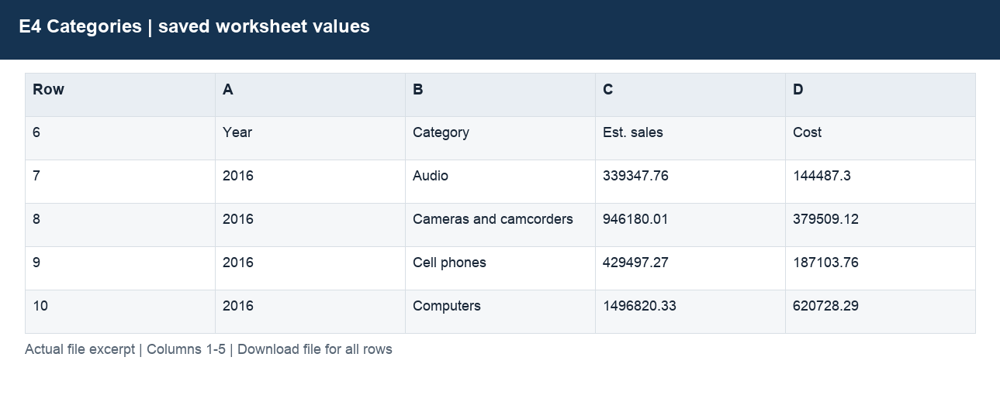

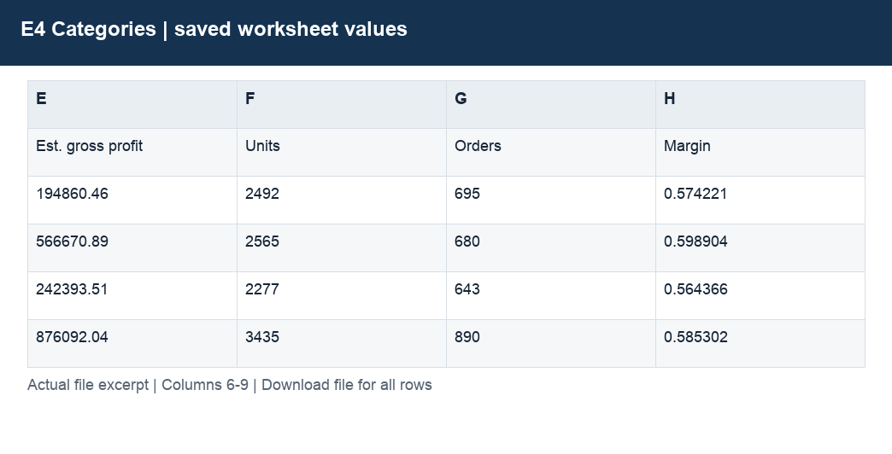

| Column | Labels / sample content | Stored type and Excel number format |
|---|---|---|
| A | E4. Product category contribution (USD); Distinct orders within each category overlap across categories. Do not add category order counts.; Year | int, str; 0; General |
| B | Category; Audio; Cameras and camcorders | str; #,##0;(#,##0);–; General |
| C | Est. sales | float, str; #,##0;(#,##0);–; General |
| D | Cost | float, str; #,##0;(#,##0);–; General |
| E | Est. gross profit | float, str; #,##0;(#,##0);–; General |
| F | Units | int, str; #,##0;(#,##0);–; General |
| G | Orders | int, str; #,##0;(#,##0);–; General |
| H | Margin | float, str; 0.0%;(0.0%);–; General |

Column labels may change between sections lower in the worksheet. Download the workbook to follow those schedules and formulas; the illustration shows only the opening populated section.

## E5 E9 Stores

Identify a consistent same-store comparison group.

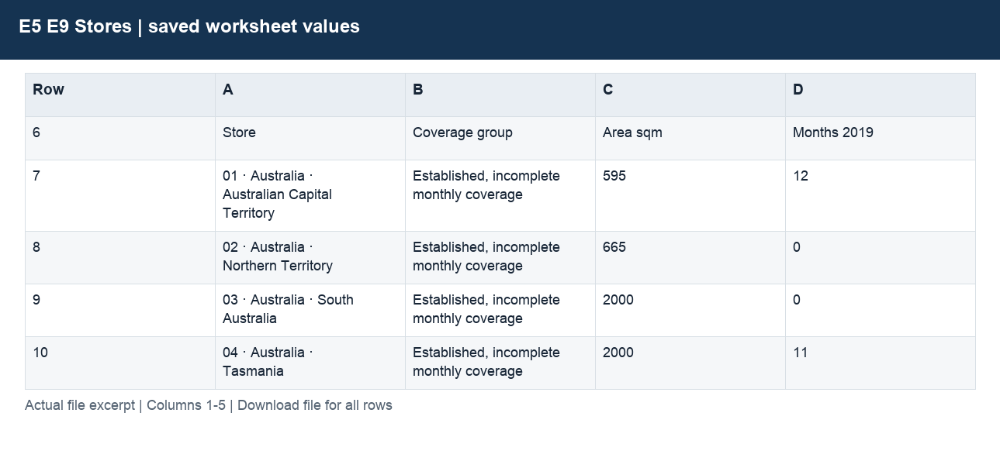

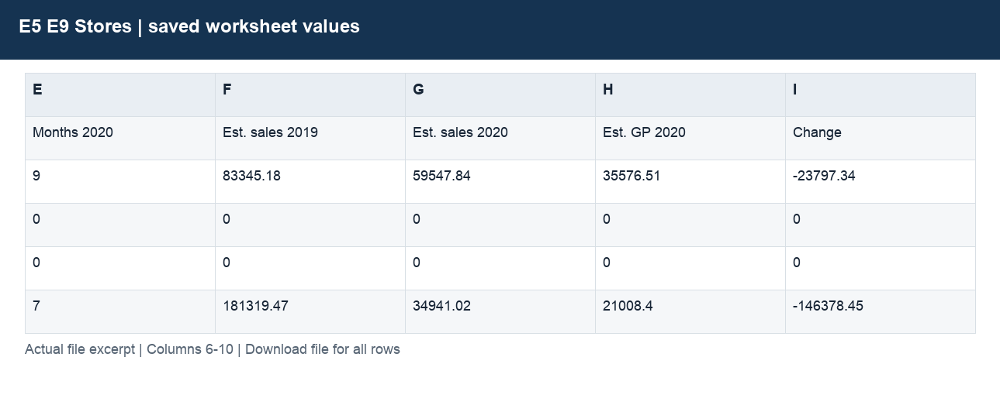

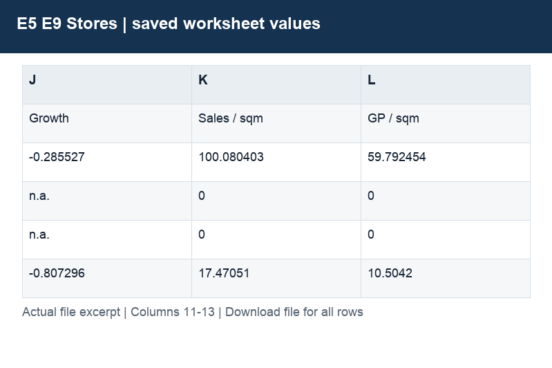

| Column | Labels / sample content | Stored type and Excel number format |
|---|---|---|
| A | E5 / E9. Comparable stores and investment screening; Strict cohort: open before 2019; sales in all 12 months in both years. No closure calendar.; Store | str; #,##0;(#,##0);–; General |
| B | Coverage group; Established, incomplete monthly coverage; Established, incomplete monthly coverage | str; #,##0;(#,##0);–; General |
| C | Area sqm | int, str; #,##0;(#,##0);–; General |
| D | Months 2019 | int, str; #,##0;(#,##0);–; General |
| E | Months 2020 | int, str; #,##0;(#,##0);–; General |
| F | Est. sales 2019 | float, int, str; #,##0;(#,##0);–; General |
| G | Est. sales 2020 | float, int, str; #,##0;(#,##0);–; General |
| H | Est. GP 2020 | float, int, str; #,##0;(#,##0);–; General |
| I | Change | float, int, str; #,##0;(#,##0);–; General |
| J | Growth; n.a.; n.a. | float, int, str; 0.0%;(0.0%);–; General |
| K | Sales / sqm | float, int, str; 0.00; General |
| L | GP / sqm | float, int, str; 0.00; General |

Column labels may change between sections lower in the worksheet. Download the workbook to follow those schedules and formulas; the illustration shows only the opening populated section.

## E6 Cohorts

Measure repeat purchasing with complete observation windows.

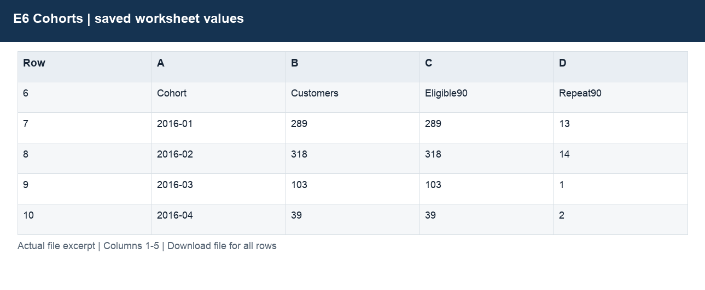

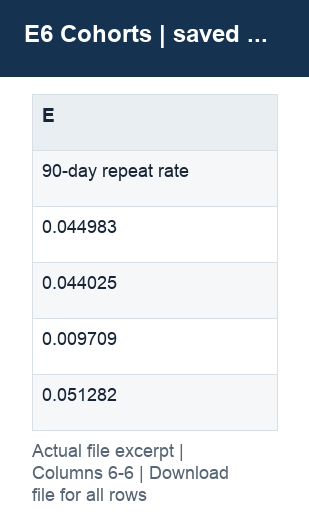

| Column | Labels / sample content | Stored type and Excel number format |
|---|---|---|
| A | E6. Repeat orders within 90 days; First observed purchase; full 90-day windows only, as of 20-Feb-2021. Distinct orders.; Cohort | str; #,##0;(#,##0);–; General |
| B | Customers | int, str; #,##0;(#,##0);–; General |
| C | Eligible90 | int, str; #,##0;(#,##0);–; General |
| D | Repeat90 | int, str; #,##0;(#,##0);–; General |
| E | 90-day repeat rate | float, int, str; 0.0%;(0.0%);–; General |

Column labels may change between sections lower in the worksheet. Download the workbook to follow those schedules and formulas; the illustration shows only the opening populated section.

## E7 Delivery

Analyse valid delivery times and illustrate exchange-rate treatment.

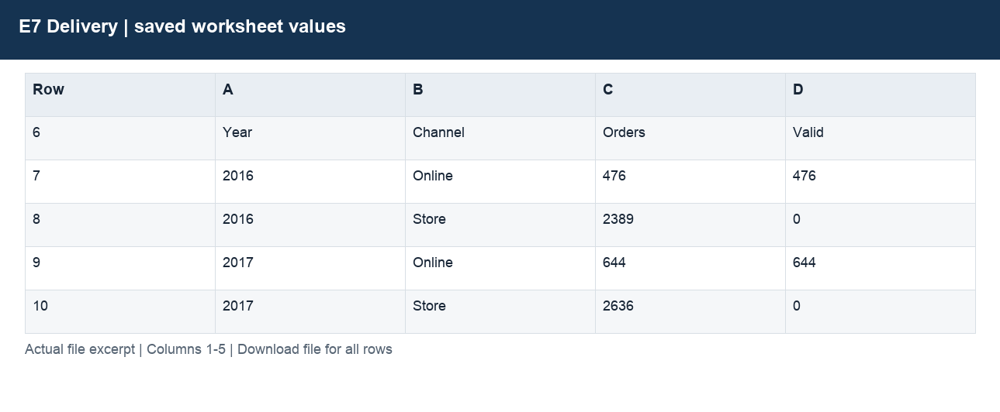

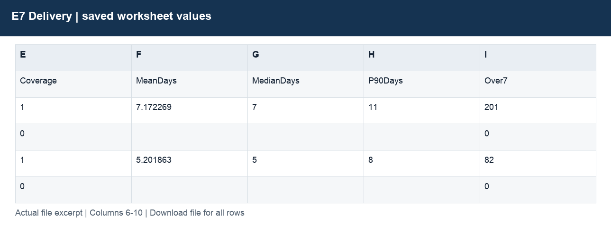

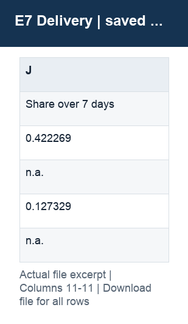

| Column | Labels / sample content | Stored type and Excel number format |
|---|---|---|
| A | E7. Order-level delivery coverage; Blank delivery dates stay unavailable. &gt;7 days is descriptive, not a contractual SLA.; Year | int, str; 0; General |
| B | Channel; Online; Store | str; #,##0;(#,##0);–; General |
| C | Orders | int, str; #,##0;(#,##0);–; General |
| D | Valid | int, str; #,##0;(#,##0);–; General |
| E | Coverage | int, str; 0.0%;(0.0%);–; General |
| F | MeanDays | float, str; 0.0; General |
| G | MedianDays | int, str; 0.0; General |
| H | P90Days | int, str; 0.0; General |
| I | Over7 | int, str; #,##0;(#,##0);–; General |
| J | Share over 7 days; n.a.; n.a. | float, str; 0.0%;(0.0%);–; General |

Column labels may change between sections lower in the worksheet. Download the workbook to follow those schedules and formulas; the illustration shows only the opening populated section.

## E8 Drivers

Explain the year-on-year revenue decline.

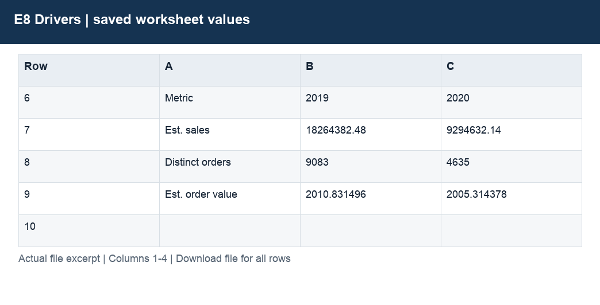

| Column | Labels / sample content | Stored type and Excel number format |
|---|---|---|
| A | E8. 2020 vs 2019 sales bridge (USD); At static product prices, order value changes reflect basket composition, not observed price changes.; Metric | str; General |
| B | 2019 | float, int, str; #,##0;(#,##0);–; 0.00; General |
| C | 2020 | float, int, str; #,##0;(#,##0);–; 0.00; General |

Column labels may change between sections lower in the worksheet. Download the workbook to follow those schedules and formulas; the illustration shows only the opening populated section.

## E1 E10 Checks

Validate joins, source coverage and reconciliation.

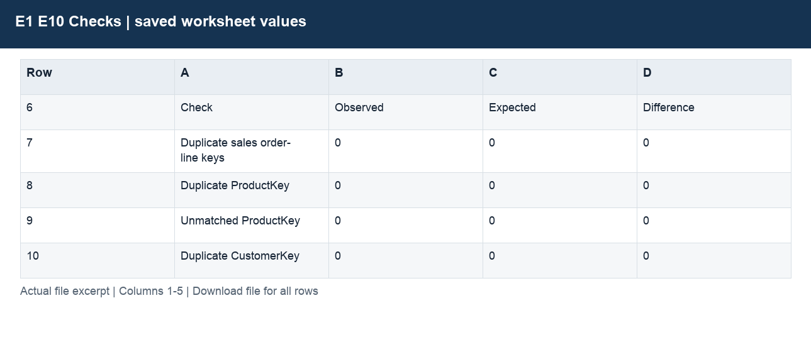

| Column | Labels / sample content | Stored type and Excel number format |
|---|---|---|
| A | E1 / E10. Preparation and update checks; Preparation checks, not a financial audit. December 2020 was held back and appended.; Check | str; #,##0;(#,##0);–; General |
| B | Observed | float, int, str; 0.00; General |
| C | Expected | float, int, str; 0.00; General |
| D | Difference | int, str; 0.00; General |

Column labels may change between sections lower in the worksheet. Download the workbook to follow those schedules and formulas; the illustration shows only the opening populated section.

