# Overview

[Download Excel file](<../worksheets/Analysis.xlsx>) · [Back to data](../README.md)

## Overview

Overview: a preview of the figures in the workbook.

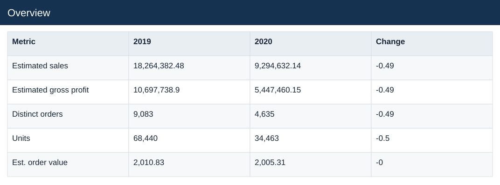

### Fields

| Field | Format | Example |
|---|---|---|
| Actual spend | Number (2 decimals) | 257,525,696.65 |
| Plan spend | Number (2 decimals) | 243,285,406.52 |
| Overspend | Number (2 decimals) | 14,240,290.13 |
| Overspend % | Percentage | 5.9% |

## Inputs

Inputs: a preview of the figures in the workbook.

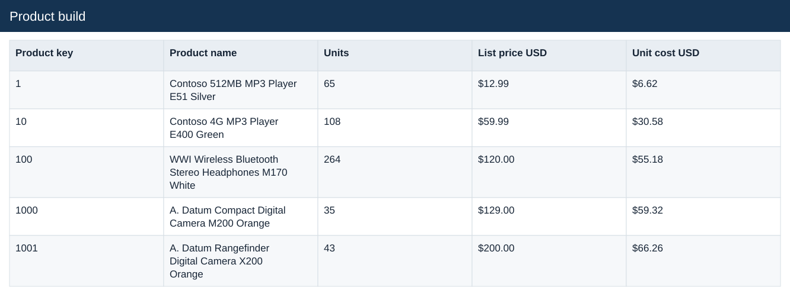

### Fields

| Field | Format | Example |
|---|---|---|
| Driver | Text | Addressable share |
| Active selection | Number (2 decimals) | 0.25 |
| No action | Whole number | 0 |
| Proposal | Number (2 decimals) | 0.25 |

## Forecast

Forecast: a preview of the figures in the workbook.

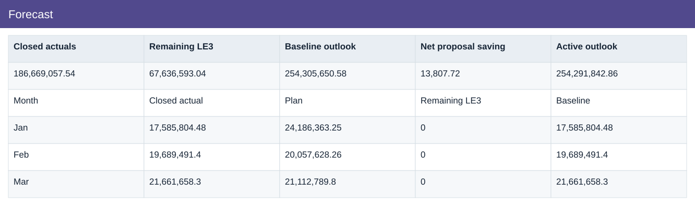

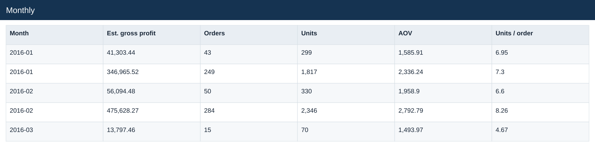

### Fields

| Field | Format | Example |
|---|---|---|
| Closed actuals | Number (2 decimals) | 186,669,057.54 |
| Remaining LE3 | Number (2 decimals) | 67,636,593.04 |
| Baseline outlook | Number (2 decimals) | 254,305,650.58 |
| Net proposal saving | Number (2 decimals) | 13,807.72 |
| Active outlook | Number (2 decimals) | 254,291,842.86 |
| Vs annual plan | Number (2 decimals) | 11,006,436.34 |

## Variance

Variance: a preview of the figures in the workbook.

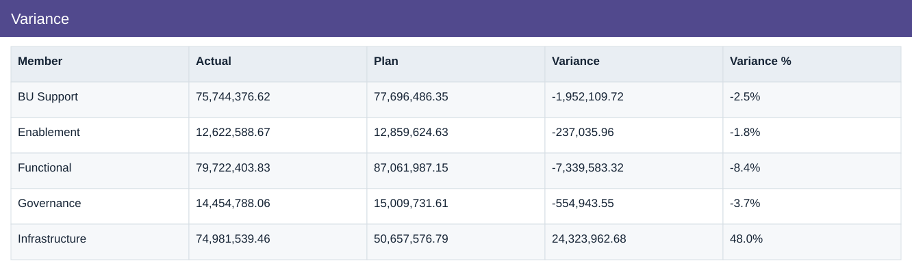

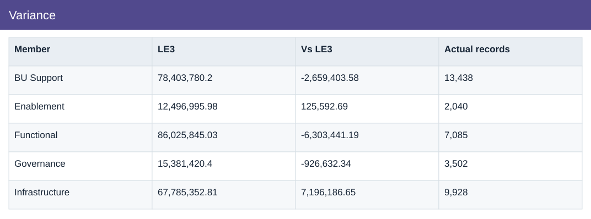

### Fields

| Field | Format | Example |
|---|---|---|
| Member | Text | BU Support |
| Actual | Number (2 decimals) | 75,744,376.62 |
| Plan | Number (2 decimals) | 77,696,486.35 |
| Variance | Number (2 decimals) | -1,952,109.72 |
| Variance % | Percentage | -2.5% |
| LE3 | Number (2 decimals) | 78,403,780.2 |
| Vs LE3 | Number (2 decimals) | -2,659,403.58 |
| Actual records | Whole number | 13,438 |

## Drivers

Drivers: a preview of the figures in the workbook.

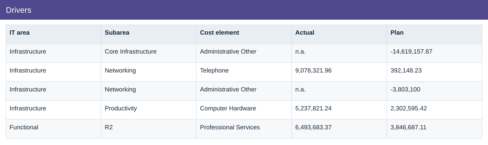

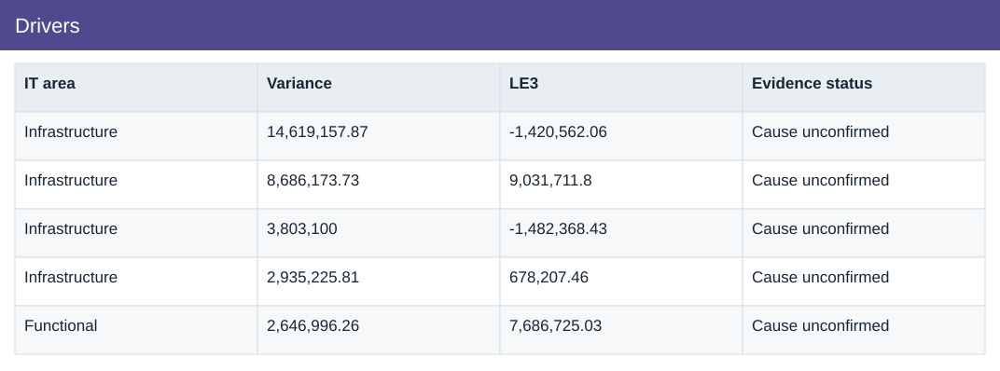

### Fields

| Field | Format | Example |
|---|---|---|
| IT area | Text | Infrastructure |
| Subarea | Text | Core Infrastructure |
| Cost element | Text | Administrative Other |
| Actual | Text | n.a. |
| Plan | Number (2 decimals) | -14,619,157.87 |
| Variance | Number (2 decimals) | 14,619,157.87 |
| LE3 | Number (2 decimals) | -1,420,562.06 |
| Evidence status | Text | Cause unconfirmed |

## Estimates

Estimates: a preview of the figures in the workbook.

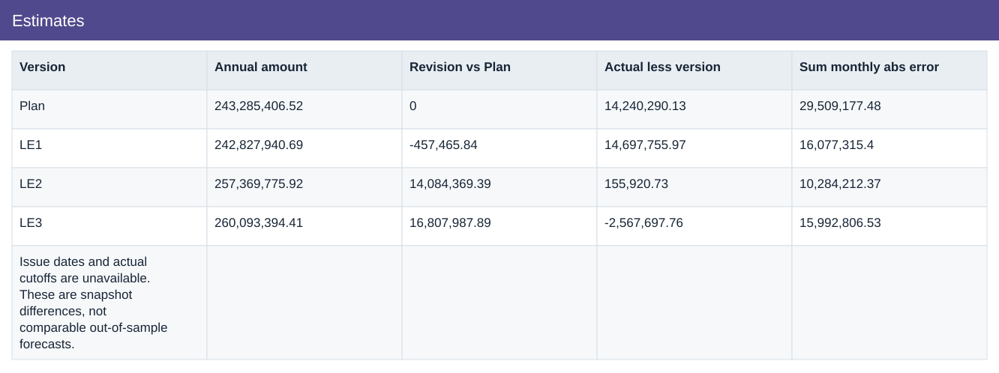

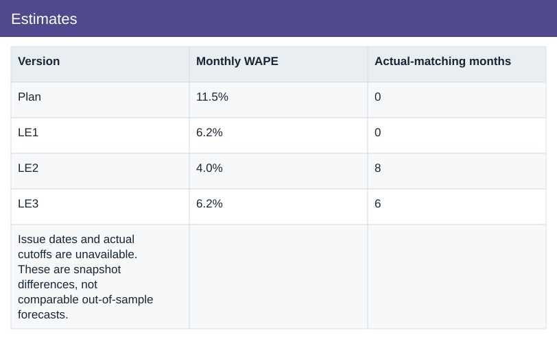

### Fields

| Field | Format | Example |
|---|---|---|
| Version | Text | Plan |
| Annual amount | Number (2 decimals) | 243,285,406.52 |
| Revision vs Plan | Whole number | 0 |
| Actual less version | Number (2 decimals) | 14,240,290.13 |
| Sum monthly abs error | Number (2 decimals) | 29,509,177.48 |
| Monthly WAPE | Percentage | 11.5% |
| Actual-matching months | Whole number | 0 |

## Patterns

Patterns: a preview of the figures in the workbook.

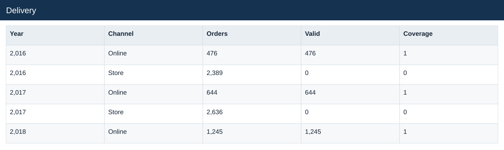

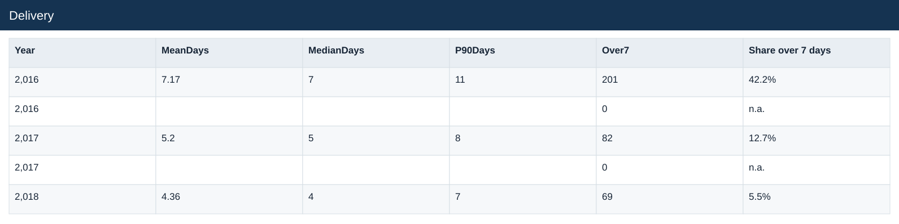

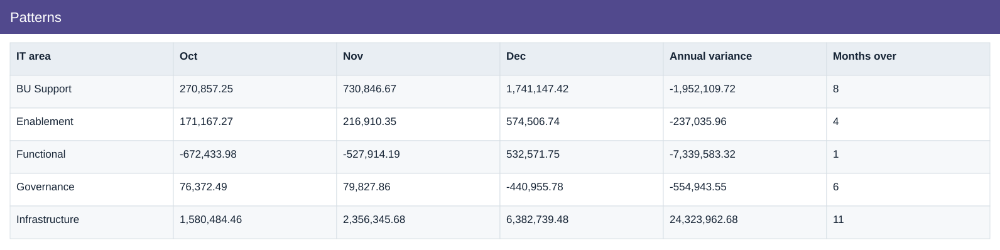

### Fields

| Field | Format | Example |
|---|---|---|
| IT area | Text | BU Support |
| Jan | Number (2 decimals) | -4,059,245.06 |
| Feb | Number (2 decimals) | 142,048.36 |
| Mar | Number (2 decimals) | -225,972.97 |
| Apr | Number (2 decimals) | -497,644.35 |
| May | Number (2 decimals) | 185,421.01 |
| Jun | Number (2 decimals) | 89,270.92 |
| Jul | Number (2 decimals) | -982,278.06 |
| Aug | Number (2 decimals) | 433,640.63 |
| Sep | Number (2 decimals) | 219,798.47 |
| Oct | Number (2 decimals) | 270,857.25 |
| Nov | Number (2 decimals) | 730,846.67 |
| Dec | Number (2 decimals) | 1,741,147.42 |
| Annual variance | Number (2 decimals) | -1,952,109.72 |
| Months over | Whole number | 8 |

## Actions

Actions: a preview of the figures in the workbook.

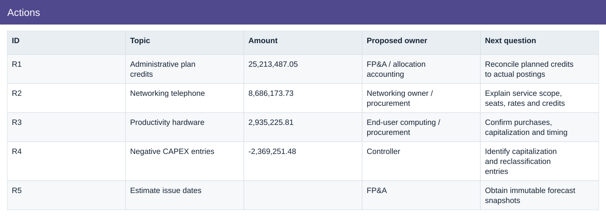

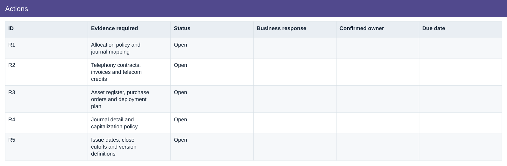

### Fields

| Field | Format | Example |
|---|---|---|
| ID | Text | R1 |
| Topic | Text | Administrative plan credits |
| Amount | Number (2 decimals) | 25,213,487.05 |
| Proposed owner | Text | FP&A / allocation accounting |
| Next question | Text | Reconcile planned credits to actual postings |
| Evidence required | Text | Allocation policy and journal mapping |
| Status | Text | Open |
| Business response | Text | — |
| Confirmed owner | Text | — |
| Due date | Text | — |

## Monthly actuals and estimates

Source: a preview of the figures in the workbook.

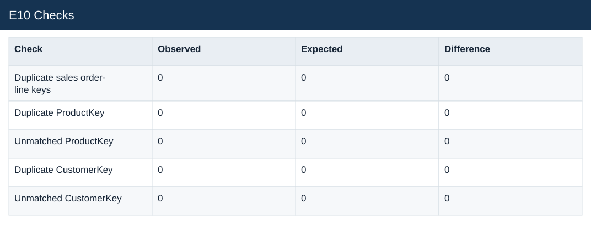

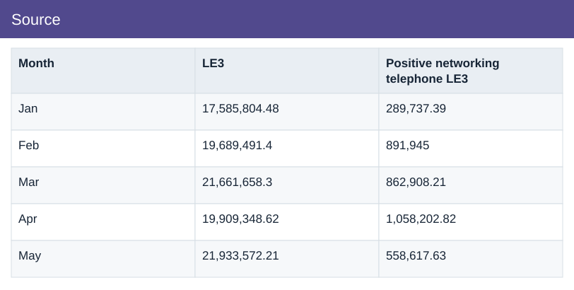

### Fields

| Field | Format | Example |
|---|---|---|
| Month | Text | Jan |
| Actual | Number (2 decimals) | 17,585,804.48 |
| Plan | Number (2 decimals) | 24,186,363.25 |
| LE1 | Number (2 decimals) | 17,613,108.74 |
| LE2 | Number (2 decimals) | 17,585,804.48 |
| LE3 | Number (2 decimals) | 17,585,804.48 |
| Positive networking telephone LE3 | Number (2 decimals) | 289,737.39 |

