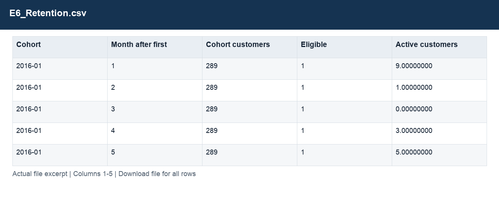
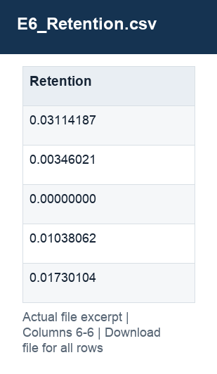

# E6_Retention.csv

[Download the complete file](../outputs/E6_Retention.csv) · [Back to data guide](../README.md)

**Purpose:** Measure repeat purchasing with complete observation windows.

**Rows:** 372. **Fields:** 6. CSV files store text; the type rules below describe how to interpret the values during import. The images render the actual first five records, with wide tables split into consecutive column panels. They are data excerpts, not screenshots of the Excel application.

## Fields and formats

| Field | Meaning / use | Import and display | Example |
|---|---|---|---|
| Cohort | Grouping, filter or comparison label for cohort. | Date / period; parse stated order, display YYYY-MM-DD or YYYY-MM | 2016-01 |
| Month after first | Field retained under its source/output label; interpret with the table purpose and displayed example. | Numeric; preserve full precision, display amount with 2 decimals where applicable | 1 |
| Cohort customers | Field retained under its source/output label; interpret with the table purpose and displayed example. | Numeric; counts as whole numbers, units/durations retain needed decimals | 289 |
| Eligible | Cohort has the required elapsed observation period. | Numeric; preserve full precision, display amount with 2 decimals where applicable | 1 |
| Active customers | Field retained under its source/output label; interpret with the table purpose and displayed example. | Numeric; counts as whole numbers, units/durations retain needed decimals | 9.00000000 |
| Retention | Active eligible cohort customers divided by eligible cohort customers. | Decimal ratio; display as 0.0% (0.10 = 10%) | 0.03114187 |
