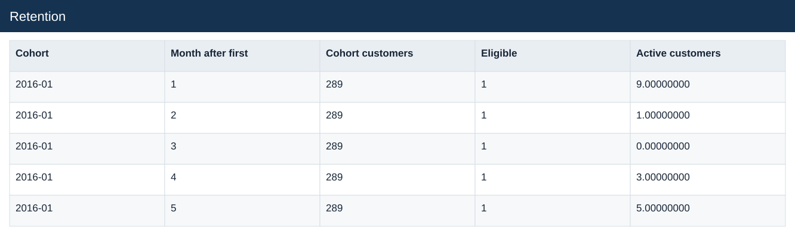
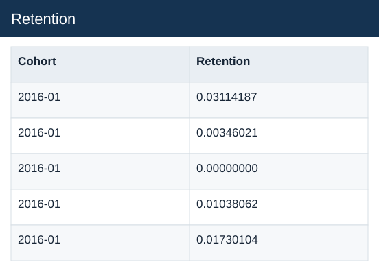

# Retention

[Download data](<../outputs/E6_Retention.csv>) · [Back to data](../README.md)

## Retention

Measure repeat purchasing with complete observation windows.

### Fields

| Field | Meaning | Format | Example |
|---|---|---|---|
| Cohort | — | Text | 2016-01 |
| Month after first | — | Number | 1 |
| Cohort customers | — | Number | 289 |
| Eligible | Cohort has the required elapsed observation period. | Number | 1 |
| Active customers | — | Number | 9.00000000 |
| Retention | Active eligible cohort customers divided by eligible cohort customers. | Number | 0.03114187 |

