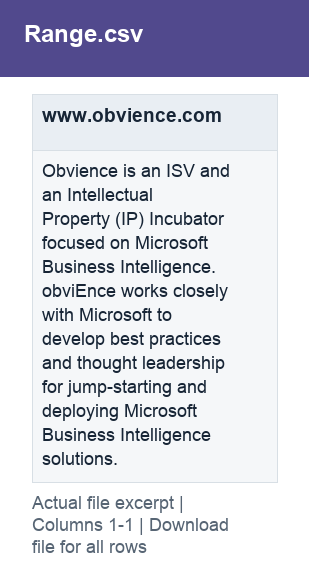

# Range.csv

[Download the complete file](../prepared_inputs/I1_Extracted_Data/Range.csv) · [Back to data guide](../README.md)

**Purpose:** Provide a prepared table for consistent joins, filtering and analysis.

**Rows:** 1. **Fields:** 1. CSV files store text; the type rules below describe how to interpret the values during import. The images render the actual first five records, with wide tables split into consecutive column panels. They are data excerpts, not screenshots of the Excel application.

## Fields and formats

| Field | Meaning / use | Import and display | Example |
|---|---|---|---|
| www.obvience.com | Field retained under its source/output label; interpret with the table purpose and displayed example. | Text / categorical label; preserve spelling and blanks | Obvience is an ISV and an Intellectual Property (IP) Incubator focused on Microsoft Business Intelligence.  obviEnce works closely with Microsoft to develop best practices and thought leadership for jump-starting and deploying Microsoft Business Intelligence solutions. |
