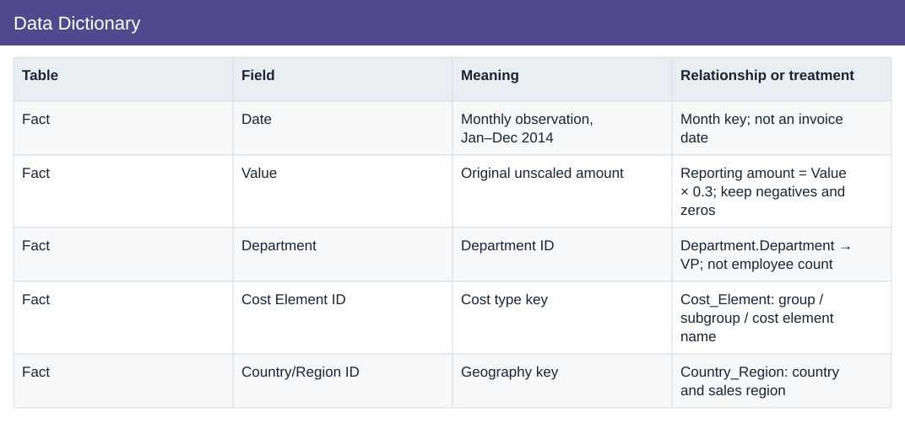

# Data Dictionary

[Download data](<../outputs/I1_Data_Dictionary.csv>) · [Back to data](../README.md)

## Data Dictionary

Validate source extraction and data consistency.

### Fields

| Field | Format | Example |
|---|---|---|
| Table | Text | Fact |
| Field | Text | Date |
| Meaning | Text | Monthly observation, Jan–Dec 2014 |
| Relationship or treatment | Text | Month key; not an invoice date |

