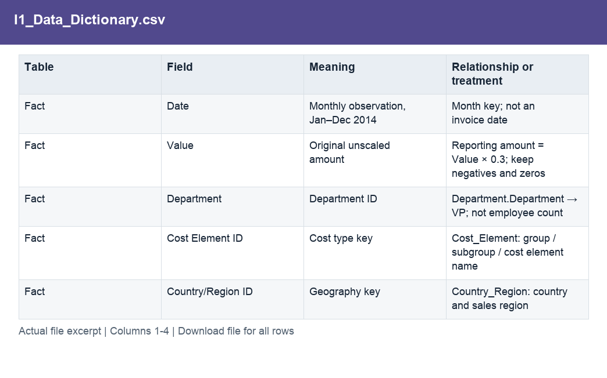

# I1_Data_Dictionary.csv

[Download the complete file](../outputs/I1_Data_Dictionary.csv) · [Back to data guide](../README.md)

**Purpose:** Validate source extraction and data consistency.

**Rows:** 13. **Fields:** 4. CSV files store text; the type rules below describe how to interpret the values during import. The images render the actual first five records, with wide tables split into consecutive column panels. They are data excerpts, not screenshots of the Excel application.

## Fields and formats

| Field | Meaning / use | Import and display | Example |
|---|---|---|---|
| Table | Field retained under its source/output label; interpret with the table purpose and displayed example. | Text / categorical label; preserve spelling and blanks | Fact |
| Field | Field retained under its source/output label; interpret with the table purpose and displayed example. | Text / categorical label; preserve spelling and blanks | Date |
| Meaning | Field retained under its source/output label; interpret with the table purpose and displayed example. | Text / categorical label; preserve spelling and blanks | Monthly observation, Jan–Dec 2014 |
| Relationship or treatment | Field retained under its source/output label; interpret with the table purpose and displayed example. | Text / categorical label; preserve spelling and blanks | Month key; not an invoice date |
