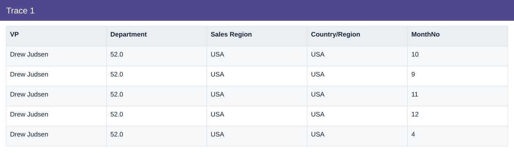
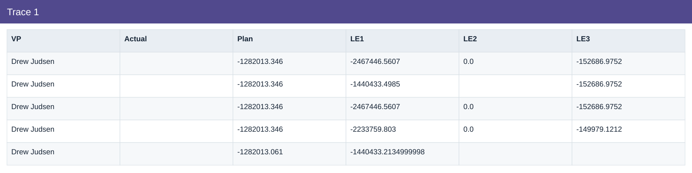
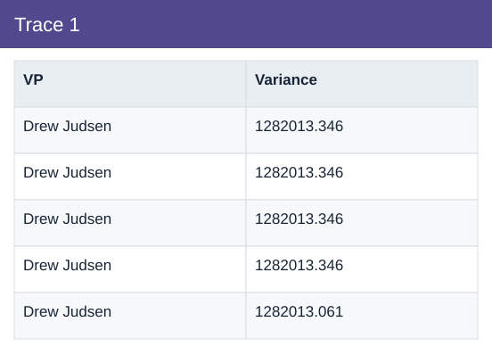

# Trace 1

[Download data](<../outputs/I4_Trace_1.csv>) · [Back to data](../README.md)

## Trace 1

Trace material cost variances to reviewable drivers.

### Fields

| Field | Meaning | Format | Example |
|---|---|---|---|
| VP | — | Text | Drew Judsen |
| Department | — | Number | 52.0 |
| Sales Region | — | Text | USA |
| Country/Region | Country/region dimension label. | Text | USA |
| MonthNo | Month number used for chronological sorting. | Number | 10 |
| Actual | Actual scenario amount. | Text | — |
| Plan | Planned scenario amount. | Number | -1282013.346 |
| LE1 | Latest estimate version 1. | Number | -2467446.5607 |
| LE2 | Latest estimate version 2. | Number | 0.0 |
| LE3 | Latest estimate version 3. | Number | -152686.9752 |
| Variance | Actual less Plan. Positive IT cost variance means over plan. | Number | 1282013.346 |

