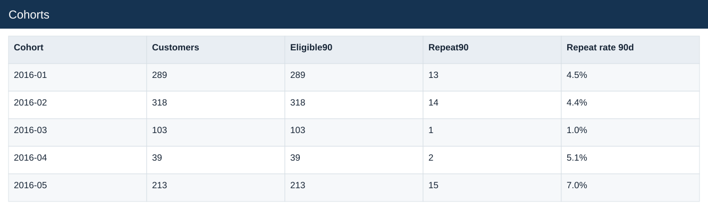

# Cohorts

[Download data](<../outputs/E6_Cohorts.csv>) · [Back to data](../README.md)

## Cohorts

Measure repeat purchasing with complete observation windows.

### Fields

| Field | Meaning | Format | Example |
|---|---|---|---|
| Cohort | — | Text | 2016-01 |
| Customers | — | Number | 289 |
| Eligible90 | Has a complete 90-day observation window after first purchase. | Number | 289 |
| Repeat90 | Repeat purchase within the defined 90-day window. | Number | 13 |
| Repeat rate 90d | Repeat90 customers divided by Eligible90 customers. | Percentage | 4.5% |

