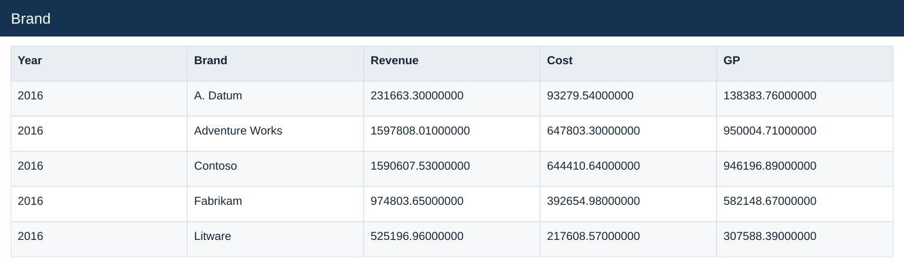
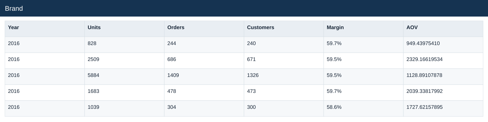
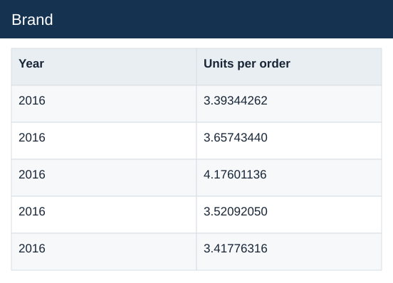

# Brand

[Download data](<../outputs/E4_Brand.csv>) · [Back to data](../README.md)

## Brand

Compare product, store and market contributions.

### Fields

| Field | Meaning | Format | Example |
|---|---|---|---|
| Year | Calendar year. | Number | 2016 |
| Brand | — | Text | A. Datum |
| Revenue | Estimated sales: quantity × static product unit price. | Number | 231663.30000000 |
| Cost | Quantity × unit product cost. | Number | 93279.54000000 |
| GP | Estimated gross profit: revenue less cost. | Number | 138383.76000000 |
| Units | — | Number | 828 |
| Orders | — | Number | 244 |
| Customers | — | Number | 240 |
| Margin | Aggregate profit divided by aggregate sales. | Percentage | 59.7% |
| AOV | Revenue divided by distinct orders. | Number | 949.43975410 |
| Units per order | Total units divided by distinct orders. | Number | 3.39344262 |

