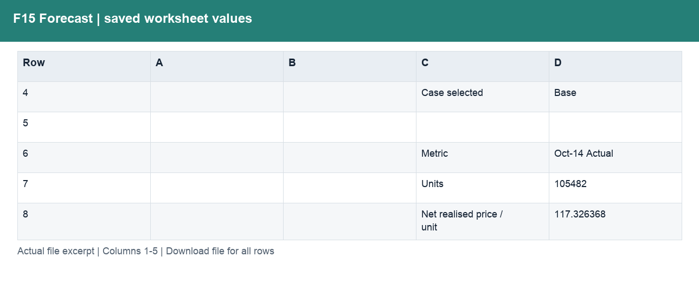
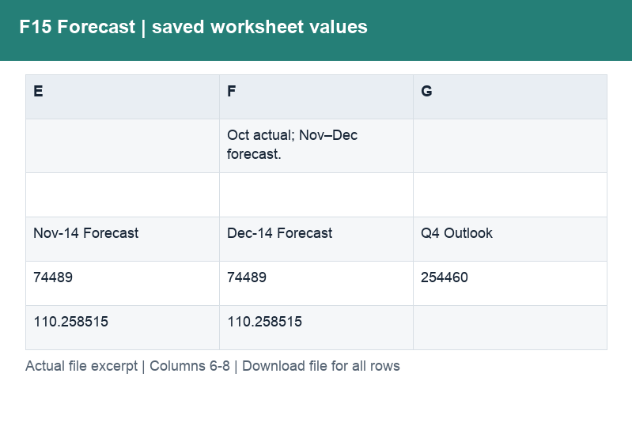
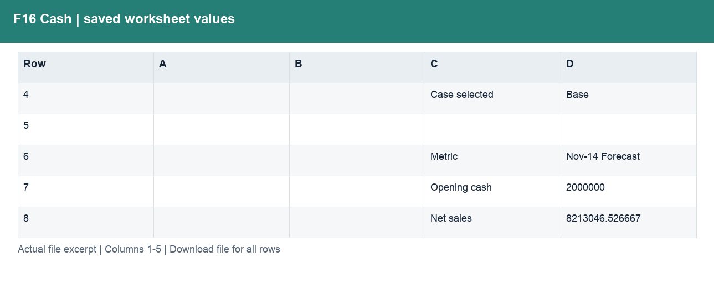
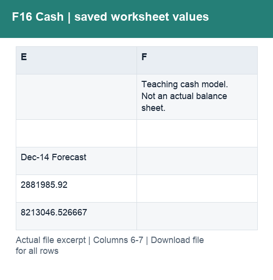
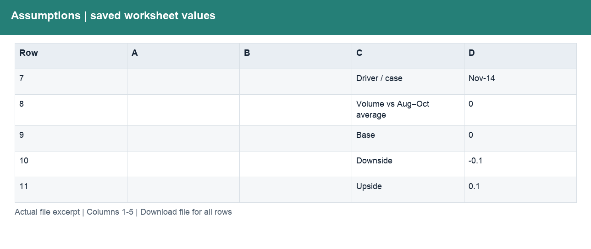
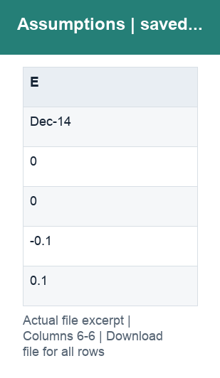
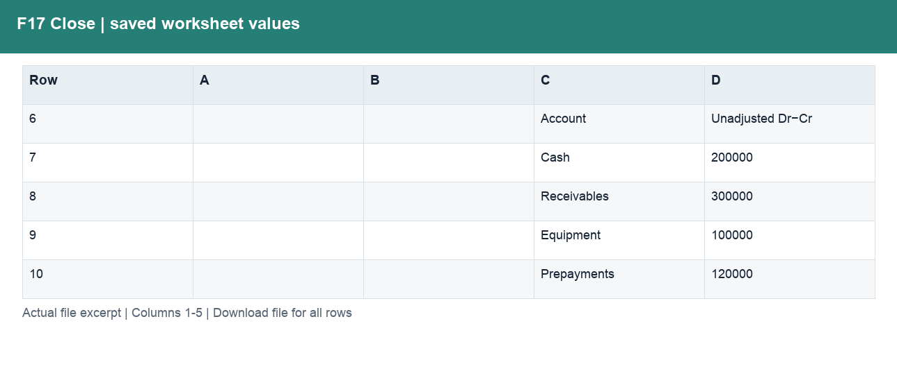
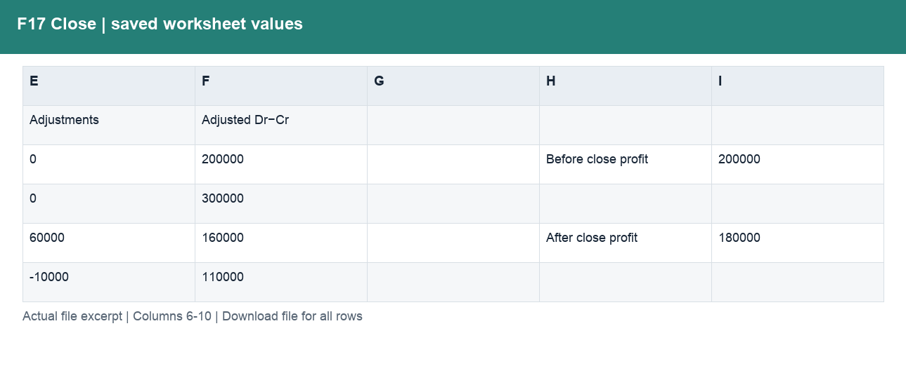
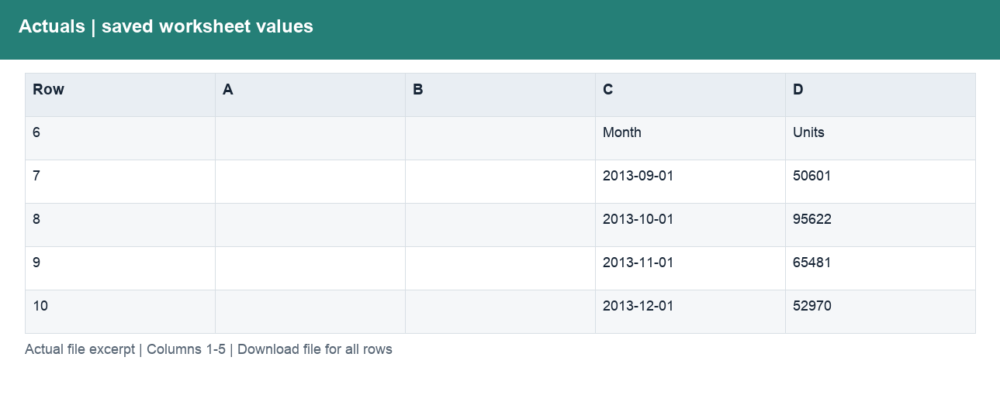
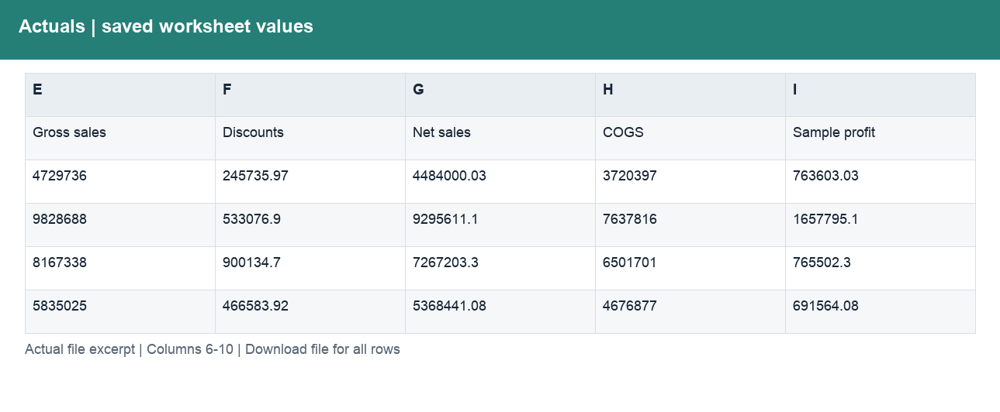

# Forecast_Cash_Close.xlsx

[Download workbook](../worksheets/Forecast_Cash_Close.xlsx) · [Back to data guide](../README.md)

This page renders saved cell values from the actual workbook. Excel workbooks mix schedules, assumptions and tables, so formats are documented by worksheet and column rather than treating the whole file as one dataset. No calculations or source cells were changed for these illustrations.

## F15 Forecast

Provide a prepared table for consistent joins, filtering and analysis.

| Column | Labels / sample content | Stored type and Excel number format |
|---|---|---|
| A | Numeric schedule values | ;  |
| B | Numeric schedule values | ;  |
| C | F15. October close and Q4 reforecast; Case selected; Metric | str; General |
| D | Base; Oct-14 Actual | float, int, str; #,##0.00; #,##0;(#,##0);–; 0.0%;(0.0%);–; 0.00; General |
| E | Nov-14 Forecast | float, int, str; #,##0.00; #,##0;(#,##0);–; 0.0%;(0.0%);–; 0.00; General |
| F | Oct actual; Nov–Dec forecast.; Dec-14 Forecast | float, int, str; #,##0.00; #,##0;(#,##0);–; 0.0%;(0.0%);–; 0.00; General |
| G | Q4 Outlook | float, int, str; #,##0.00; #,##0;(#,##0);–; 0.0%;(0.0%);–; 0.00; General |

Column labels may change between sections lower in the worksheet. Download the workbook to follow those schedules and formulas; the illustration shows only the opening populated section.

## F16 Cash

Provide a prepared table for consistent joins, filtering and analysis.

| Column | Labels / sample content | Stored type and Excel number format |
|---|---|---|
| A | Numeric schedule values | ;  |
| B | Numeric schedule values | ;  |
| C | F16. Profit to cash and funding need; Case selected; Metric | str; General |
| D | Base; Nov-14 Forecast | float, int, str; #,##0;(#,##0);–; General |
| E | Dec-14 Forecast | float, int, str; #,##0;(#,##0);–; General |
| F | Teaching cash model. Not an actual balance sheet. | str; General |

Column labels may change between sections lower in the worksheet. Download the workbook to follow those schedules and formulas; the illustration shows only the opening populated section.

## Assumptions

Provide a prepared table for consistent joins, filtering and analysis.

| Column | Labels / sample content | Stored type and Excel number format |
|---|---|---|
| A | Numeric schedule values | ;  |
| B | Numeric schedule values | ;  |
| C | Forecast and cash assumptions; Case selected; 1 Base; 2 Downside; 3 Upside | str; General |
| D | Base; Nov-14 | float, int, str; #,##0;(#,##0);–; 0; 0.0%;(0.0%);–; General |
| E | Dec-14 | float, int, str; #,##0;(#,##0);–; 0; 0.0%;(0.0%);– |

Column labels may change between sections lower in the worksheet. Download the workbook to follow those schedules and formulas; the illustration shows only the opening populated section.

## F17 Close

Provide a prepared table for consistent joins, filtering and analysis.

| Column | Labels / sample content | Stored type and Excel number format |
|---|---|---|
| A | Numeric schedule values | ;  |
| B | Numeric schedule values | ;  |
| C | F17. Accrual close and adjusted trial balance; Fully synthetic teaching ledger. Separate from Financial Sample.; Account | str; General |
| D | Unadjusted Dr−Cr; Account; Operating expenses | int, str; #,##0;(#,##0);–; 0.00; General |
| E | Adjustments; Debit | int, str; #,##0;(#,##0);–; 0.00; General |
| F | Adjusted Dr−Cr; Credit | int, str; #,##0;(#,##0);–; 0.00; General |
| G | Numeric schedule values | ;  |
| H | Before close profit; After close profit; Profit adjustment | str; #,##0;(#,##0);– |
| I | Numeric schedule values | int; #,##0;(#,##0);–; 0.00 |

Column labels may change between sections lower in the worksheet. Download the workbook to follow those schedules and formulas; the illustration shows only the opening populated section.

## Actuals

Provide a prepared table for consistent joins, filtering and analysis.

| Column | Labels / sample content | Stored type and Excel number format |
|---|---|---|
| A | Numeric schedule values | ;  |
| B | Numeric schedule values | ;  |
| C | Monthly source actuals; https://learn.microsoft.com/en-us/power-bi/create-reports/sample-financial-download; Month | datetime, str; General; mmm-yy |
| D | Units | float, int, str; #,##0.0; General |
| E | Gross sales | float, int, str; #,##0;(#,##0);–; General |
| F | Discounts | float, str; #,##0;(#,##0);–; General |
| G | Net sales | float, str; #,##0;(#,##0);–; General |
| H | COGS | float, int, str; #,##0;(#,##0);–; General |
| I | Sample profit | float, str; #,##0;(#,##0);–; General |

Column labels may change between sections lower in the worksheet. Download the workbook to follow those schedules and formulas; the illustration shows only the opening populated section.

