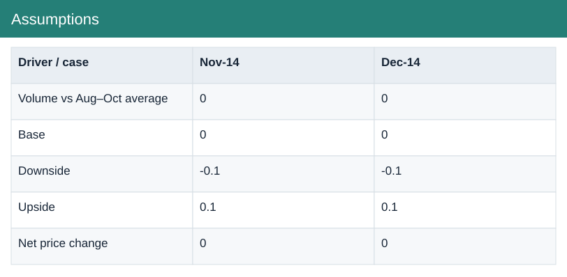
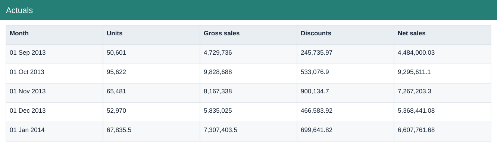
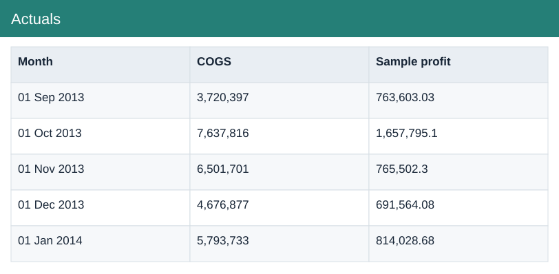

# Forecast Cash Close

[Download Excel file](<../worksheets/Commercial_Finance_2_Analysis.xlsx>) · [Back to data](../README.md)

## Forecast

Forecast: a preview of the figures in the workbook.

### Fields

| Field | Format | Example |
|---|---|---|
| Metric | Text | Units |
| Oct-14 Actual | Whole number | 105,482 |
| Nov-14 Forecast | Whole number | 74,489 |
| Dec-14 Forecast | Whole number | 74,489 |
| Q4 Outlook | Whole number | 254,460 |

## Cash

Cash: a preview of the figures in the workbook.

### Fields

| Field | Format | Example |
|---|---|---|
| Metric | Text | Opening cash |
| Nov-14 Forecast | Whole number | 2,000,000 |
| Dec-14 Forecast | Number (2 decimals) | 2,881,985.92 |

## Assumptions

Assumptions: a preview of the figures in the workbook.

### Fields

| Field | Format | Example |
|---|---|---|
| Driver / case | Text | Volume vs Aug–Oct average |
| Nov-14 | Whole number | 0 |
| Dec-14 | Whole number | 0 |

## Close

Close: a preview of the figures in the workbook.

### Fields

| Field | Format | Example |
|---|---|---|
| Account | Text | Cash |
| Unadjusted Dr−Cr | Whole number | 200,000 |
| Adjustments | Whole number | 0 |
| Adjusted Dr−Cr | Whole number | 200,000 |

## Actuals

Actuals: a preview of the figures in the workbook.

### Fields

| Field | Format | Example |
|---|---|---|
| Month | Date | 01 Sep 2013 |
| Units | Whole number | 50,601 |
| Gross sales | Whole number | 4,729,736 |
| Discounts | Number (2 decimals) | 245,735.97 |
| Net sales | Number (2 decimals) | 4,484,000.03 |
| COGS | Whole number | 3,720,397 |
| Sample profit | Number (2 decimals) | 763,603.03 |

