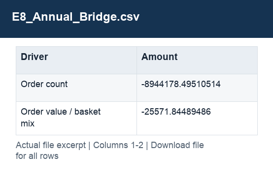

# E8_Annual_Bridge.csv

[Download the complete file](../outputs/E8_Annual_Bridge.csv) · [Back to data guide](../README.md)

**Purpose:** Explain the year-on-year revenue decline.

**Rows:** 2. **Fields:** 2. CSV files store text; the type rules below describe how to interpret the values during import. The images render the actual first five records, with wide tables split into consecutive column panels. They are data excerpts, not screenshots of the Excel application.

## Fields and formats

| Field | Meaning / use | Import and display | Example |
|---|---|---|---|
| Driver | Field retained under its source/output label; interpret with the table purpose and displayed example. | Text / categorical label; preserve spelling and blanks | Order count |
| Amount | Field retained under its source/output label; interpret with the table purpose and displayed example. | Numeric; preserve full precision, display amount with 2 decimals where applicable | -8944178.49510514 |
