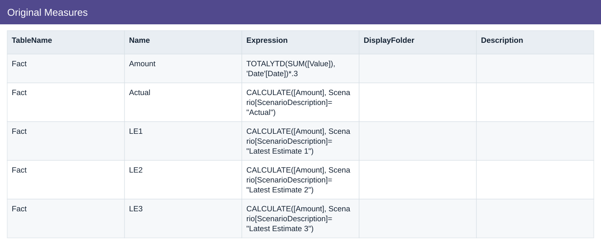

# Original Measures

[Download data](<../prepared_inputs/I1_Extracted_Data/Original_Measures.csv>) · [Back to data](../README.md)

## Original Measures

View the budget, actual amounts and calculations.

### Fields

| Field | Format | Example |
|---|---|---|
| TableName | Text | Fact |
| Name | Text | Amount |
| Expression | Text | TOTALYTD(SUM([Value]), 'Date'[Date])*.3 |
| DisplayFolder | Text | — |
| Description | Text | — |

