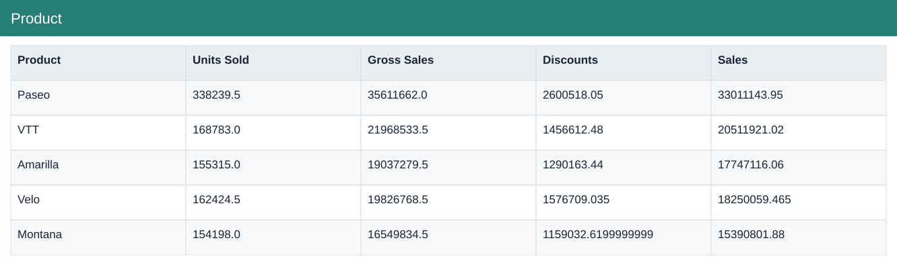
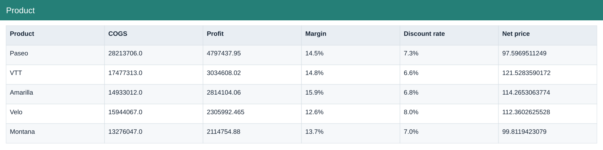

# Product

[Download data](<../outputs/F3-F4_Product.csv>) · [Back to data](../README.md)

## Product

Compare product, country and segment economics.

### Fields

| Field | Meaning | Format | Example |
|---|---|---|---|
| Product | — | Text | Paseo |
| Units Sold | Sample units sold; fractional values are preserved. | Number | 338239.5 |
| Gross Sales | Units sold × sale price, before discounts. | Number | 35611662.0 |
| Discounts | Discount amount deducted from gross sales. | Number | 2600518.05 |
| Sales | Net sales after discounts. | Number | 33011143.95 |
| COGS | Cost of goods sold from the source sample. | Number | 28213706.0 |
| Profit | Sales less COGS; not full company net profit. | Number | 4797437.95 |
| Margin | Aggregate profit divided by aggregate sales. | Percentage | 14.5% |
| Discount rate | Total discounts divided by total gross sales. | Percentage | 7.3% |
| Net price | Net sales divided by units sold. | Number | 97.5969511249 |

