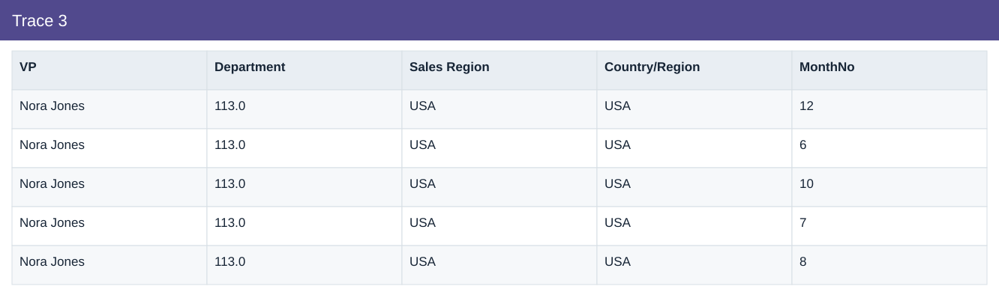
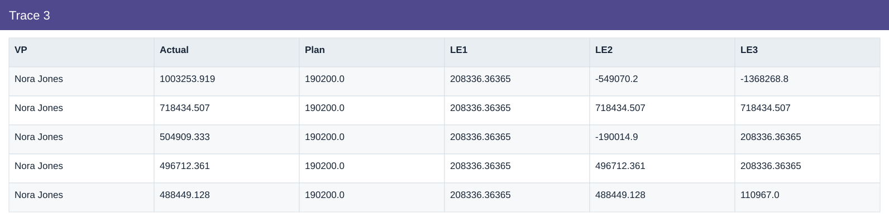
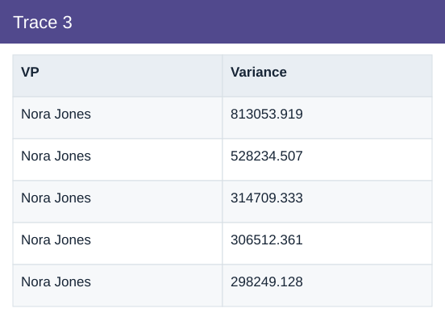

# Trace 3

[Download data](<../outputs/I4_Trace_3.csv>) · [Back to data](../README.md)

## Trace 3

Trace material cost variances to reviewable drivers.

### Fields

| Field | Meaning | Format | Example |
|---|---|---|---|
| VP | — | Text | Nora Jones |
| Department | — | Number | 113.0 |
| Sales Region | — | Text | USA |
| Country/Region | Country/region dimension label. | Text | USA |
| MonthNo | Month number used for chronological sorting. | Number | 12 |
| Actual | Actual scenario amount. | Number | 1003253.919 |
| Plan | Planned scenario amount. | Number | 190200.0 |
| LE1 | Latest estimate version 1. | Number | 208336.36365 |
| LE2 | Latest estimate version 2. | Number | -549070.2 |
| LE3 | Latest estimate version 3. | Number | -1368268.8 |
| Variance | Actual less Plan. Positive IT cost variance means over plan. | Number | 813053.919 |

