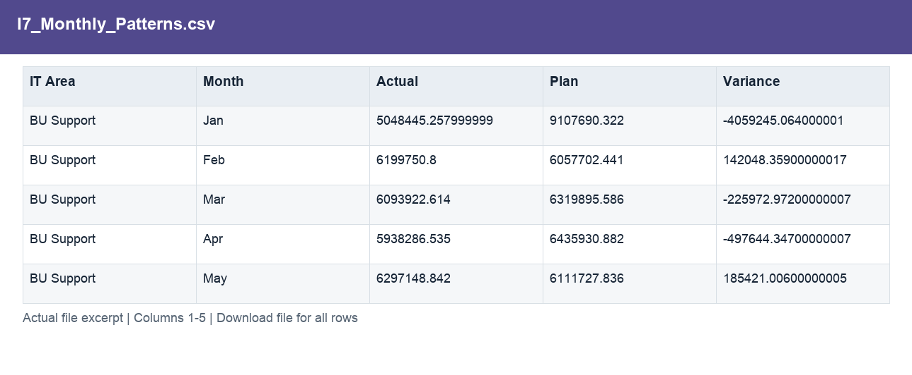
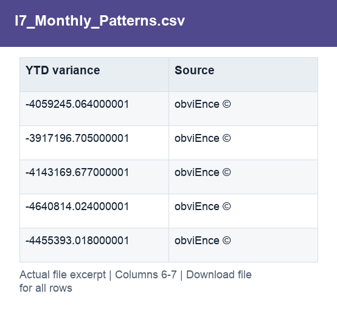

# I7_Monthly_Patterns.csv

[Download the complete file](../outputs/I7_Monthly_Patterns.csv) · [Back to data guide](../README.md)

**Purpose:** Distinguish recurring variance patterns from monthly offsets.

**Rows:** 60. **Fields:** 7. CSV files store text; the type rules below describe how to interpret the values during import. The images render the actual first five records, with wide tables split into consecutive column panels. They are data excerpts, not screenshots of the Excel application.

## Fields and formats

| Field | Meaning / use | Import and display | Example |
|---|---|---|---|
| IT Area | Grouping, filter or comparison label for it area. | Text / categorical label; preserve spelling and blanks | BU Support |
| Month | Month label or month-start key. | Text / categorical label; preserve spelling and blanks | Jan |
| Actual | Actual scenario amount. | Numeric; preserve full precision, display amount with 2 decimals where applicable | 5048445.257999999 |
| Plan | Planned scenario amount. | Numeric; preserve full precision, display amount with 2 decimals where applicable | 9107690.322 |
| Variance | Actual less Plan. Positive IT cost variance means over plan. | Numeric; preserve full precision, display amount with 2 decimals where applicable | -4059245.064000001 |
| YTD variance | Field retained under its source/output label; interpret with the table purpose and displayed example. | Numeric; preserve full precision, display amount with 2 decimals where applicable | -4059245.064000001 |
| Source | Field retained under its source/output label; interpret with the table purpose and displayed example. | Text / categorical label; preserve spelling and blanks | obviEnce © |
