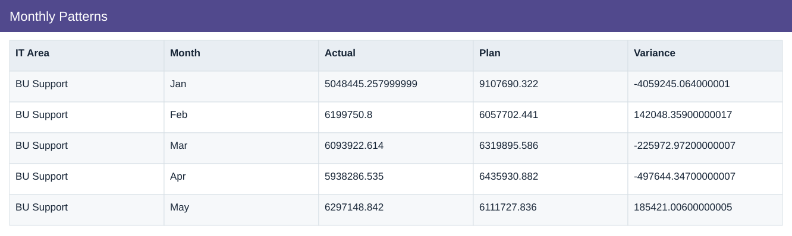
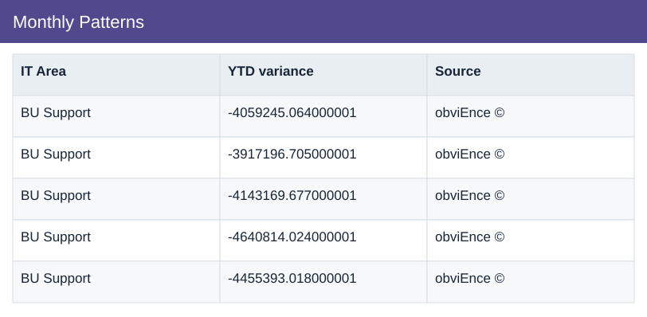

# Monthly Patterns

[Download data](<../outputs/I7_Monthly_Patterns.csv>) · [Back to data](../README.md)

## Monthly Patterns

Distinguish recurring variance patterns from monthly offsets.

### Fields

| Field | Meaning | Format | Example |
|---|---|---|---|
| IT Area | — | Text | BU Support |
| Month | Month label or month-start key. | Text | Jan |
| Actual | Actual scenario amount. | Number | 5048445.257999999 |
| Plan | Planned scenario amount. | Number | 9107690.322 |
| Variance | Actual less Plan. Positive IT cost variance means over plan. | Number | -4059245.064000001 |
| YTD variance | — | Number | -4059245.064000001 |
| Source | — | Text | obviEnce © |

