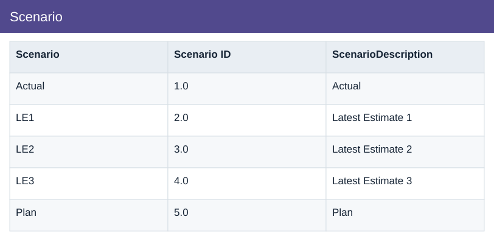

# Scenario

[Download data](<../prepared_inputs/I1_Extracted_Data/Scenario.csv>) · [Back to data](../README.md)

## Scenario

View the budget, actual amounts and calculations.

### Fields

| Field | Format | Example |
|---|---|---|
| Scenario | Text | Actual |
| Scenario ID | Number | 1.0 |
| ScenarioDescription | Text | Actual |

