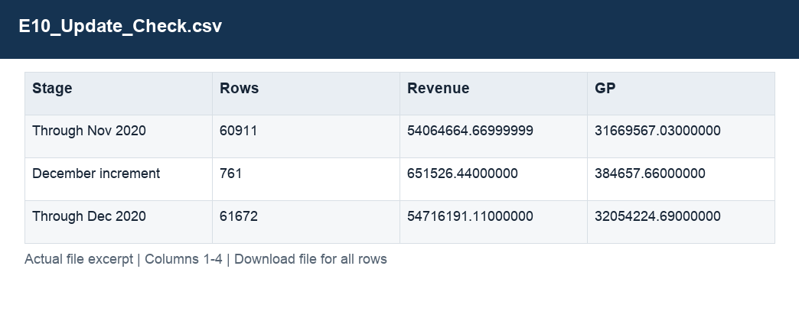

# E10_Update_Check.csv

[Download the complete file](<../outputs/E10_Update_Check.csv>) · [Back to data guide](../README.md)

**Purpose:** Check the monthly update and handover totals.

**Rows:** 3. **Fields:** 4. CSV files store text; the type rules below describe how to interpret the values during import. The images render the actual first five records, with wide tables split into consecutive column panels. They are data excerpts, not screenshots of the Excel application.

## Fields and formats

| Field | Meaning / use | Import and display | Example |
|---|---|---|---|
| Stage | Field retained under its source/output label; interpret with the table purpose and displayed example. | Text / categorical label; preserve spelling and blanks | Through Nov 2020 |
| Rows | Field retained under its source/output label; interpret with the table purpose and displayed example. | Numeric; counts as whole numbers, units/durations retain needed decimals | 60911 |
| Revenue | Estimated sales: quantity × static product unit price. | Numeric; preserve full precision, display amount with 2 decimals where applicable | 54064664.66999999 |
| GP | Estimated gross profit: revenue less cost. | Numeric; preserve full precision, display amount with 2 decimals where applicable | 31669567.03000000 |
