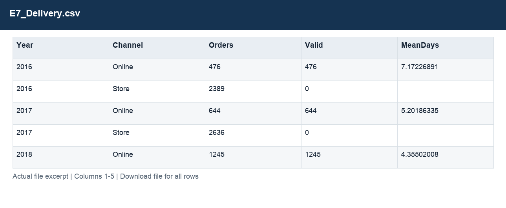
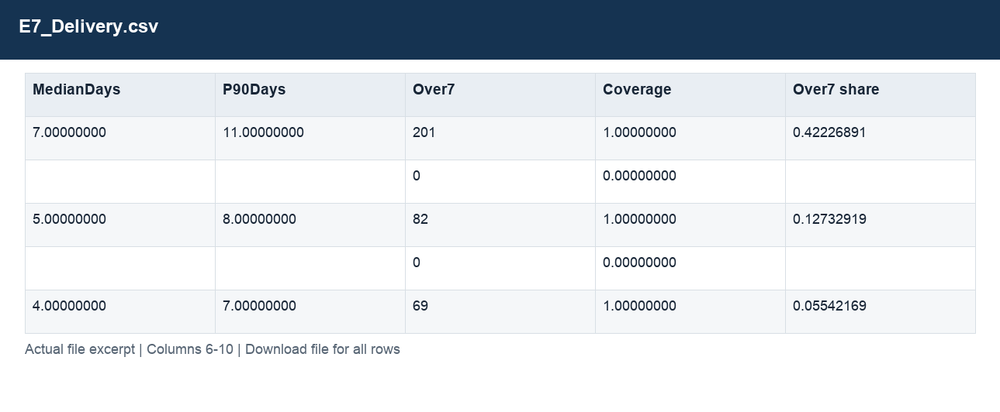

# E7_Delivery.csv

[Download the complete file](<../outputs/E7_Delivery.csv>) · [Back to data guide](../README.md)

**Purpose:** Analyse valid delivery times and illustrate exchange-rate treatment.

**Rows:** 12. **Fields:** 10. CSV files store text; the type rules below describe how to interpret the values during import. The images render the actual first five records, with wide tables split into consecutive column panels. They are data excerpts, not screenshots of the Excel application.

## Fields and formats

| Field | Meaning / use | Import and display | Example |
|---|---|---|---|
| Year | Calendar year. | Numeric; counts as whole numbers, units/durations retain needed decimals | 2016 |
| Channel | Grouping, filter or comparison label for channel. | Text / categorical label; preserve spelling and blanks | Online |
| Orders | Field retained under its source/output label; interpret with the table purpose and displayed example. | Numeric; counts as whole numbers, units/durations retain needed decimals | 476 |
| Valid | Field retained under its source/output label; interpret with the table purpose and displayed example. | Numeric; preserve full precision, display amount with 2 decimals where applicable | 476 |
| MeanDays | Mean valid delivery duration in days. | Numeric; counts as whole numbers, units/durations retain needed decimals | 7.17226891 |
| MedianDays | Median valid delivery duration in days. | Numeric; counts as whole numbers, units/durations retain needed decimals | 7.00000000 |
| P90Days | 90th percentile valid delivery duration in days. | Numeric; counts as whole numbers, units/durations retain needed decimals | 11.00000000 |
| Over7 | Count of valid deliveries taking more than seven days. | Numeric; preserve full precision, display amount with 2 decimals where applicable | 201 |
| Coverage | Coverage definition for this output; consult the analysis context. | Numeric; preserve full precision, display amount with 2 decimals where applicable | 1.00000000 |
| Over7 share | Over7 divided by valid deliveries. | Decimal ratio; display as 0.0% (0.10 = 10%) | 0.42226891 |
